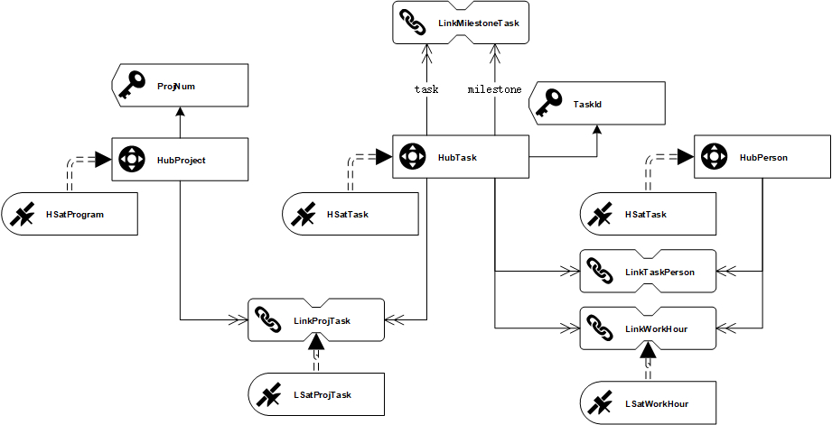
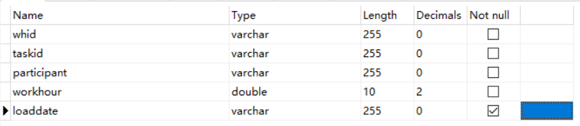

## 0.DataVault模型更新



## 1.数据源获取

### 1.1.mysql中间表设计



[dv.workhour.sql](./assets/workhour.sql)


### 1.2.workhour schema

#### raw

```json
{
	"type": "record",
	"name": "workhour",
	"namespace": "any.data",
	"fields": [
		{
			"name": "whid",
			"type": [
				"null",
				"string"
			]
		},
		{
			"name": "taskid",
			"type": [
				"null",
				"string"
			]
		},
		{
			"name": "participant",
			"type": [
				"null",
				"string"
			]
		},
		{
			"name": "workhour",
			"type": [
				"null",
				"double"
			]
		},
		{
			"name": "loaddate",
			"type": [
				"null",
				"string"
			]
		}
	]
}
```

#### load

```json
{
	"type": "record",
	"name": "workhour",
	"namespace": "any.data",
	"fields": [
		{
			"name": "whid",
			"type": [
				"null",
				"string"
			]
		},
		{
			"name": "taskid",
			"type": [
				"null",
				"string"
			]
		},
		{
			"name": "participant",
			"type": [
				"null",
				"string"
			]
		},
		{
			"name": "workhour",
			"type": [
				"null",
				"double"
			]
		},
		{
			"name": "loaddate",
			"type": [
				"null",
				"string"
			]
		}
	]
}
```


## 2.mysql中间层配置

[Zeus.ResourceLocation.sql](./assets/ResourceLocation.sql)


## 3.StageArea新增内容

### 3.1.plm_workhour

| Table        | Field        | Type   | key  |
| ------------ | ------------ | ------ | ---- |
| plm_workhour | whid         | string | PK   |
| plm_workhour | loaddate     | bigint | PK   |
| plm_workhour | taskid       | string |      |
| plm_workhour | participant  | string |      |
| plm_workhour | workhour     | float  |      |
| plm_workhour | HTaskHK      | string |      |
| plm_workhour | HPersonHK    | string |      |
| plm_workhour | LWorkhourHK  | string |      |
| plm_workhour | RecordSource | string |      |

#### create

```sql
create table stagearea.plm_workhour(
	whid string,
    loaddate bigint,
    taskid string,
    participant string,
    workhour float,
    HTaskHK string,
    HPersonHK string,
    LWorkhourHK string,
    RecordSource string,
    lsworkhourhashdiff string,
    primary key(whid,loaddate)
) stored as kudu;
```

#### load

```sql
select 
	whid as whid
	,loaddate as loaddate
	,taskid as taskid
	,participant as participant
	,workhour as workhour
	,md5(taskid) as htaskhk
	,md5(participant) as hpersonhk
	,md5(concat_ws(';',taskid,participant,whid)) as lworkhourhk
	,md5(concat_ws(';','ArasPlm.workhour',workhour)) as lsworkhourhashdiff
	,'ArasPlm.workhour' as recordsource
from dv.workhour
```


## 4.DataVault新增内容

### 4.1 TLinkWorkhour

| Table         | Field                            | Type   | key  |
| ------------- | -------------------------------- | ------ | ---- |
| TLinkWorkhour | LWorkhourHK（md5(tsk+psn+whid）) | string | PK   |
| TLinkWorkhour | loaddate                         | bigint |      |
| TLinkWorkhour | RecordSource                     | string |      |
| TLinkWorkhour | HTaskHK                          | string | UK   |
| TLinkWorkhour | HPersonHK                        | string | UK   |
| TLinkWorkhour | whid                             | string | UK   |

#### create

```sql
create table rawdatavault.TLinkWorkhour(
	LWorkhourHK string
    ,loaddate bigint
    ,RecordSource string
    ,HTaskHK string
    ,HPersonHK string
    ,whid string
    ,primary key (LWorkhourHK)
) partition by Hash(LWorkhourHK)partitions 4 
stored as kudu;
```

#### load

```sql
insert into rawdatavault.TLinkWorkhour
select distinct stg.LWorkhourHK,stg.loaddate,stg.recordsource,stg.HTaskHK,stg.HPersonHK,stg.whid
from stagearea.plm_workhour stg 
where not exists (select 1 from rawdatavault.TLinkWorkhour tgt where tgt.HTaskHK=stg.HTaskHK and tgt.HPersonHK = stg.HPersonHK and tgt.whid = stg.whid)
and loaddate = ${loaddate};
```


### 4.2 TLSatWorkhour

| Table         | Field        | Type   | key  |
| ------------- | ------------ | ------ | ---- |
| TLSatWorkhour | LWorkhourHK  | string | PK   |
| TLSatWorkhour | loaddate     | bigint | PK   |
| TLSatWorkhour | loadenddate  | bigint |      |
| TLSatWorkhour | RecordSource | string |      |
| TLSatWorkhour | workhour     | float  | PL   |

#### create

```sql
create table rawdatavault.TLSatWorkhour(
	LWorkhourHK string
    ,loaddate bigint
    ,loadenddate bigint
    ,RecordSource string
    ,workhour float
    ,LSWorkhourhashdiff string
    ,primary key (LWorkhourHK,loaddate)
) partition by Hash(LWorkhourHK)partitions 4,
Range (LoadDate) (
	-- 2018.10.01 00：00：00前
	partition 0<values<=1538323200,
	-- 2018.10.01 00：00：00 到 2018.12.31 23：59：59（2018第四季度）
    partition 1538323200<values<=1546271999,
	-- 2019第一季度
    partition 1546271999<values<=1554047999
)
stored as kudu;
-- 新增分区时可以使用以下语法：
-- ALTER TABLE HSatTask ADD RANGE PARTITION 1554047999<VALUES<=${后续分区时间节点}; 
```

#### load

```sql
-- 指定数据插入的目标表
insert into rawdatavault.TLSatWorkhour
-- 从数据源选择目标表需要的字段，注意去重
select distinct stg.LWorkhourHK,stg.LoadDate,null,stg.recordsource,stg.workhour,stg.LSWorkhourhashdiff
from stagearea.plm_workhour stg 
-- 以下脚本是为了筛选出Delta记录（即新增及存在更新的记录），由于HashDiff只反应负载数据(payload)不能仅仅通过HashDiff去判断是否为Delta记录。 本处处理逻辑为：通过依赖键来关联stg跟tgt，剔除loadenddate不为空（即已失效的记录），并通过限定HashDiff不相等来保证是更新/新增的记录
left outer join rawdatavault.TLSatWorkhour tgt
on (stg.LWorkhourHK=tgt.LWorkhourHK and tgt.loadenddate is null)
where (nvl(stg.LSWorkhourhashdiff,'')!=nvl(tgt.LSWorkhourhashdiff,''))
and stg.loaddate=${loaddate};

```

#### enddating

```sql
UPDATE tgt
SET tgt.loadenddate= src.loadenddate
FROM rawdatavault.TLSatWorkhour tgt
LEFT JOIN
  (SELECT el.LWorkhourHK AS LWorkhourHK,
          el.loaddate AS loaddate,
          min(lt.loaddate)-1 AS loadenddate
   FROM rawdatavault.TLSatWorkhour el
   LEFT JOIN rawdatavault.TLSatWorkhour lt ON (el.LWorkhourHK=lt.LWorkhourHK
                            AND el.loaddate<lt.loaddate)
   GROUP BY el.LWorkhourHK,
            el.loaddate) src ON tgt.LWorkhourHK=src.LWorkhourHK
AND tgt.loaddate=src.loaddate


-- ${sat}=hsattask ${sathk}=htaskhk
```


## 5.BusinessVault

### 5.1.br_workhour

#### create

```sql

```

#### load

```sql

```


## 6.InformationMart新增内容

### 6.1.fact_workhour

```sql
create view plm_datamart.fact_workhour as 
select 
    br.hprojecthk as ProjectKey
    ,br.htaskhk as TaskKey
    ,br.hpeosonhk as PersonKey
    -- ,br.lworkhourhk as WorkhourKey
    ,sat.workhour as Workhour
from bizvault.br_workhour br ,rawdatavault.tlsatworkhour sat 
where br.lworkhourhk=sat.lworkhourhk
and sat.loadenddate is null;
```

