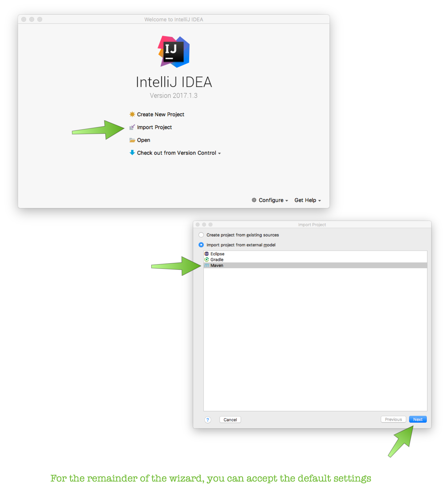
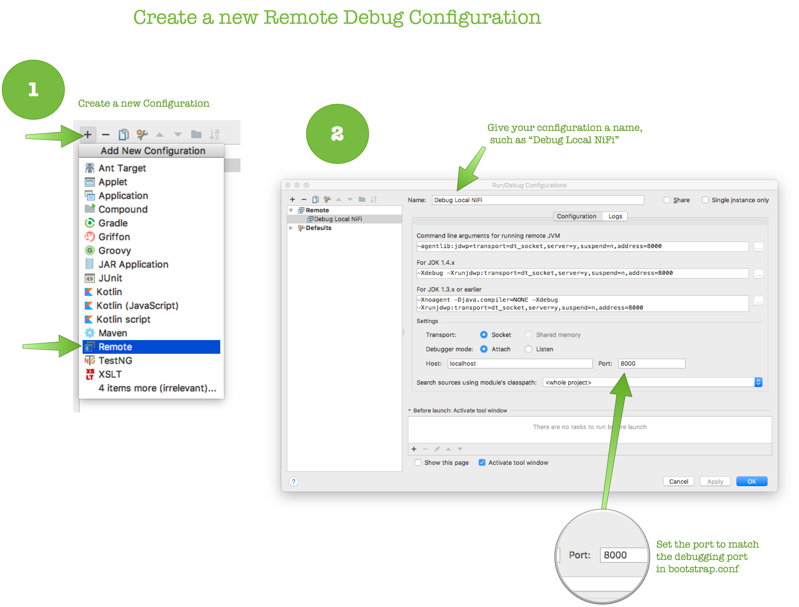
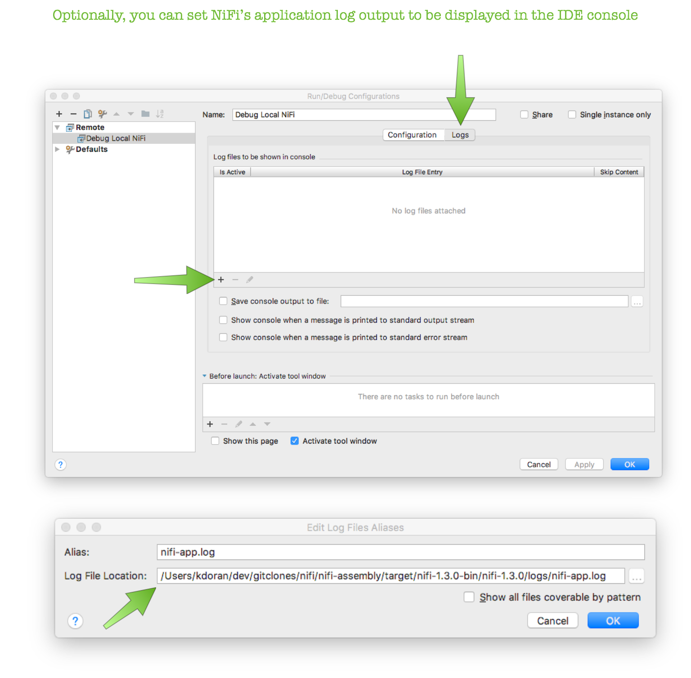
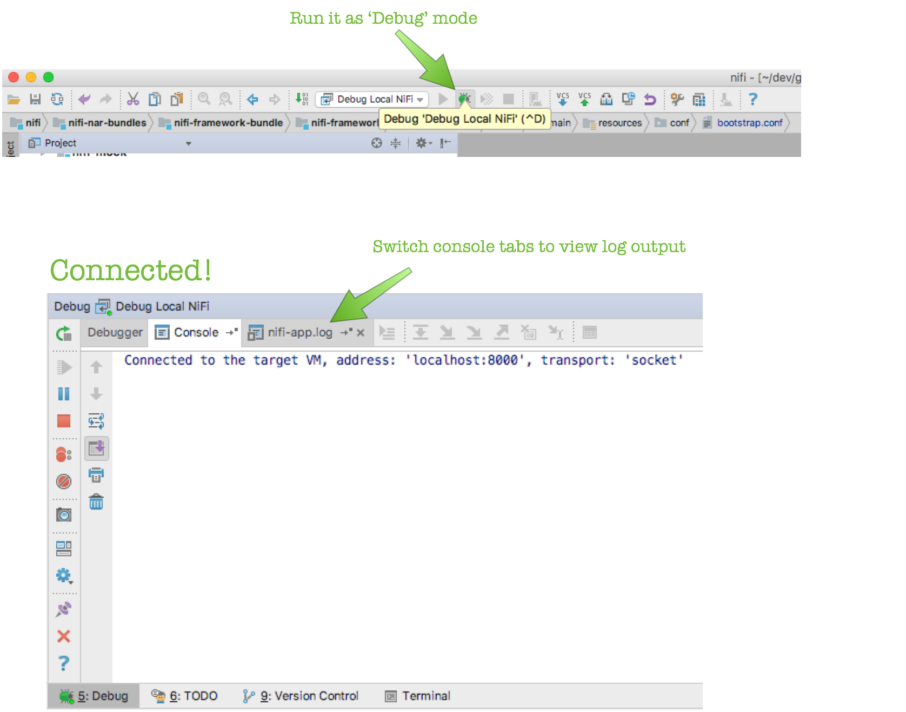

# NiFi Debugging Tutorial

#### Short Description:

Learn how to adjust NiFi log levels to show debug output and attach a graphical debugger such as IntelliJ IDEA.

#### Article

This is a beginner's guide for debugging a running NiFi instance. It covers two important aspects of debugging: adjusting the log levels of what is written to the NiFi application logs and attaching a graphical debugger to a running NiFi instance.

## Requirements

- Apache NiFi source code (this tutorial uses NiFi 1.3.0)
  - If you have never build and run NiFi from source, follow the instructions in the NiFi Development Quick Start Guide: <https://nifi.apache.org/quickstart.html>
  - In this tutorial, {NIFI_ROOT} refers to the location of your NiFi source directory, i.e., your git clone or uncompressed source directory.
- IntelliJ IDEA (this tutorial was made using IntelliJ IDEA Community 2107.01)
  - Available from: <https://www.jetbrains.com/idea/download>

If you are using other version of Apache NiFi or IntelliJ IDEA, the steps should be very similar though some of the details and example screen shots might vary slightly.

## 

## Enabling Debug Logging

By default, the log level for NiFi is set to INFO, meaning log lines set to DEBUG and below are suppressed. If you are developing or troubleshooting NiFi, you may find it useful to adjust the logging level to show more verbose logging output. If you are only interested in attaching a debugger, you can skip this section.

The log level is controlled by the logback configuration file, which, after you have built from source, is located at:

```
{NIFI_ROOT}/nifi-assembly/target/nifi-1.3.0-bin/nifi-1.3.0/conf/logback.xml
```

In this file, you will find a section of XML that looks like:

```
        <logger name="org.apache.nifi" level="INFO"/>    <logger name="org.apache.nifi.processors" level="WARN"/>    <logger name="org.apache.nifi.processors.standard.LogAttribute" level="INFO"/>    <logger name="org.apache.nifi.processors.standard.LogMessage" level="INFO"/>    <logger name="org.apache.nifi.controller.repository.StandardProcessSession" level="WARN" />...    <logger name="com.sun.jersey.spi.container.servlet.WebComponent" level="ERROR"/>    <logger name="com.sun.jersey.spi.spring" level="ERROR"/>    <logger name="org.springframework" level="ERROR"/>
```

If there are specific packages or classes you want to enable debug logging for, simply add an override:

```
    <logger name="org.apache.nifi.PACKAGE_OF_INTEREST" level="DEBUG"/> 
```

This will be applied recursively to all sub-packages, unless a sub-package has an override. If you want to mute a noisy class in a package for which you enable debug logging, you can add:

```
    <logger name="org.apache.nifi.PACKAGE_OF_INTEREST.NoisyClass" level="WARN"/> 
```

Note, the logger/class name of origin is included in each log line, so you can use that to determine what to mute. If you don't know what you are looking for specifically, you can also change to overall log level for 'org.apache.nifi' to DEBUG:

```
    <logger name="org.apache.nifi" level="DEBUG"/> 
```

If you do this, I recommend also adding these two overrides at a minimum to avoid a ton of log output:

```
    <logger name="org.apache.nifi.engine.FlowEngine" level="INFO"/>    <logger name="org.apache.nifi.controller.repository" level="INFO"/>
```

When you are done making your changes, save and close this file.

*Note, after modifying logback.xml, you do not have to restart NiFi. After a few minutes, the configuration changes will be picked up and the logger's behavior will reflect the new settings.*

## Attaching a Debugger to NiFi

In order to enable remote debugging for NiFI, we need to edit the bootstrap configuration located here:

```
{NIFI_ROOT}/nifi-assembly/target/nifi-1.3.0-bin/nifi-1.3.0/conf/bootstrap.conf 
```

Open this file in your text editor of choice and **uncomment** this line:

```
java.arg.debug=-agentlib:jdwp=transport=dt_socket,server=y,suspend=n,address=8000
```

Make a note of the "address=XXXX" value, which in this example is the default '8000'. This is the port the debugger will connect to. After uncommenting the config line that enables remote debugging, start (or restart) NiFi using the instructions in the Quick Start Guide. Verify you can access your local NiFi instance by going to this URL in a web browser: <http://localhost:8080/nifi/>

Now let's setup an IntelliJ IDEA Project, which we will use for debugging NiFi.

First thing to do, if you have not already, is create an IntelliJ IDEA Project from our cloned repository:

1. Launch IntelliJ IDEA, and in the "Welcome to IntelliJ IDEA" screen, select "Import." Navigate to the root directory of your NiFi clone, i.e. what I have been referring to as {NIFI_ROOT}
2. NiFi uses the Maven build systems, so IntelliJ IDEA will be able to import it to create an IDEA project:
   1. Choose "Import project from external model"
   2. Select "Maven" as the external model type
3. Click Next. For the remainder of the wizard, you can accept the default settings by clicking "Next" through the remaining steps.



You will end in the primary IDE view with your project viewer. Note, it may take several minutes to index and fully load. (This is normally done in the background, with progress shown in the status bar at the bottom.)

Next, let's create a Run/Debug Configuration that tells IntelliJ how to attach to our NiFi instance:

1. From the Menu: Run > Edit Configurations...
2. Click the '+' button and select 'Remote' from the drop down
3. Give the new configuration a name such as "Debug Local NiFi"
4. Change the "Port" field to the port that matched the address=XXXX line in bootstrap.conf above (in my case, 8000).
5. Optional step: Setup the IntelliJ console to display NiFi logs for this configuration.
   1. Switch from the "Configuration" tab to the "Logs"
   2. Click the '+' button in the middle of the panel to add a log file
      1. Choose whatever alias you want
      2. Set the log file location: {NIFI_ROOT}/nifi-assembly/target/nifi-1.3.0-bin/nifi-1.3.0/logs/nifi-app.log
6. Save this configuration.





You can now run the configuration to attach to your local NiFi instance whenever NiFi is running on localhost:8080. To launch the debugger, follow the steps in these screenshots:



That's it! NiFi's logging output, set to the proper level of debug output, is available in a table in the IntelliJ IDEA console and we can set a breakpoints in the NiFi source code and pause / step-through lines of code from your running NiFi instance.

```
Happy debugging!
```