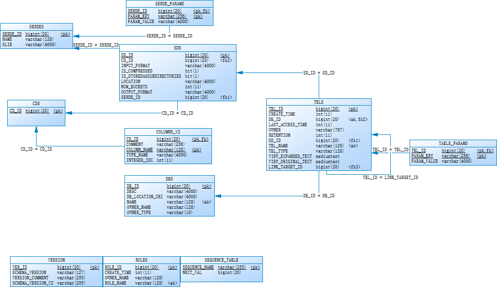
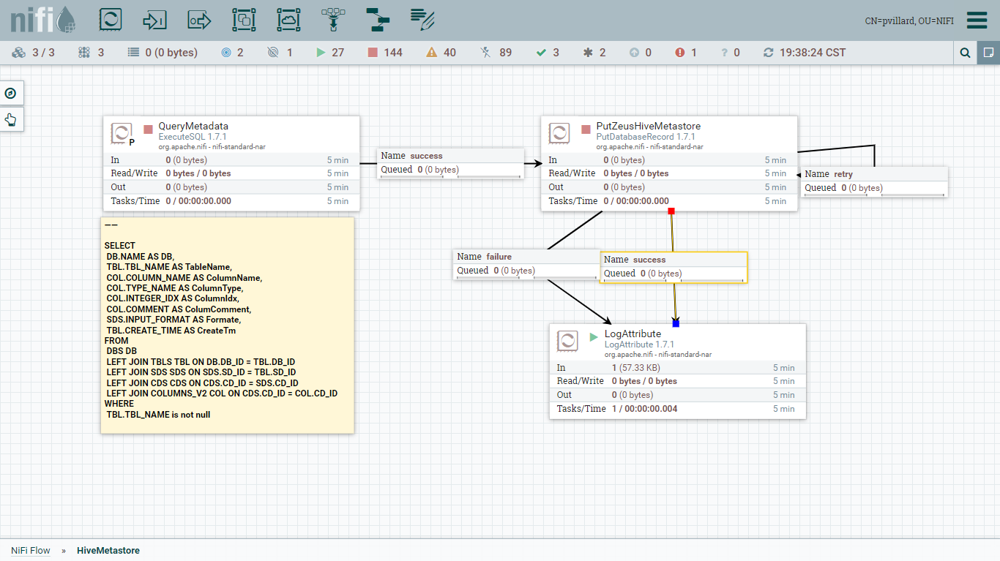
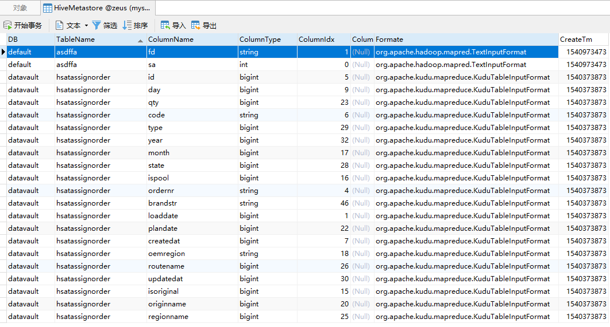

# Kudu数据库Metastore同步到Zeus

## 1.Hive Metastore数据库




## 2.获取metadata

```mysql
SELECT 
	DB.NAME AS DB,
	TBL.TBL_NAME AS TableName,
	COL.COLUMN_NAME AS ColumnName,
	COL.TYPE_NAME AS ColumnType,
	COL.INTEGER_IDX AS ColumnIdx,
	COL.COMMENT AS ColumComment,
	SDS.INPUT_FORMAT AS Formate,
	TBL.CREATE_TIME AS CreateTm 
FROM
	DBS DB
	LEFT JOIN TBLS TBL ON DB.DB_ID = TBL.DB_ID
	LEFT JOIN SDS SDS ON SDS.SD_ID = TBL.SD_ID
	LEFT JOIN CDS CDS ON CDS.CD_ID = SDS.CD_ID
	LEFT JOIN COLUMNS_V2 COL ON CDS.CD_ID = COL.CD_ID
WHERE 
	TBL.TBL_NAME is not null
```

## 3.Zues建表

### 表结构

| 字段     | Code         | Type    | Comment                        |
| -------- | ------------ | ------- | ------------------------------ |
| 数据库   | DB           | varchar | 数据库名称                     |
| 表名     | TableName    | varchar |                                |
| 列名     | ColumnName   | varchar |                                |
| 数据类型 | ColumnType   | varchar |                                |
| 字段序号 | ColumnIdx    | bigint  |                                |
| 字段备注 | ColumComment | varchar |                                |
| 表类型   | Formate      | varchar | 区别是kudu表还是其他类型Hive表 |
| 建表时间 | CreateTm     | bigint  |                                |
|          |              |         |                                |

### 脚本

```mysql
DROP TABLE IF EXISTS zeus.`HiveMetastore`;
CREATE TABLE `zeus`.`HiveMetastore`  (
  `DB` varchar(256) CHARACTER SET utf8 COLLATE utf8_bin NOT NULL,
  `TableName` varchar(256) CHARACTER SET utf8 COLLATE utf8_bin NOT NULL,
  `ColumnName` varchar(256) CHARACTER SET utf8 COLLATE utf8_bin NOT NULL,
  `ColumnType` varchar(256) CHARACTER SET utf8 COLLATE utf8_bin NULL DEFAULT NULL,
  `ColumnIdx` bigint(20) NULL DEFAULT NULL,
  `ColumComment` varchar(256) CHARACTER SET utf8 COLLATE utf8_bin NULL DEFAULT NULL,
  `Formate` varchar(256) CHARACTER SET utf8 COLLATE utf8_bin NULL DEFAULT NULL,
  `CreateTm` bigint(20) NULL DEFAULT NULL,
  PRIMARY KEY (`DB`, `TableName`, `ColumnName`) USING BTREE
);
```


## 4. NiFi 作业流程




## 5.任务结果

mysql@gateway001 --> zeus --> HiveMetastore

