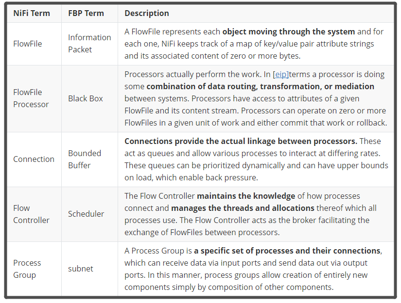

## [What is Apache NiFi?](https://nifi.apache.org/docs/nifi-docs/html/overview.html#what-is-apache-nifi)

An easy to use, powerful, and reliable system to process and distribute data.

## [The core concepts of NiFi](https://nifi.apache.org/docs/nifi-docs/html/overview.html#the-core-concepts-of-nifi)

### FlowFile

一个FlowFile代表每个被系统处理的数据对象，一个FlowFile由两部分组成：属性（FlowFile Attributes）和内容（FlowFile Content）。内容是数据本身，属性是与数据相关的key-value的键值对，用于描述数据。所有flowFile都有以下标准属性：uuid、filename、path

### FlowFile Processor

Processor是NiFi的组件，可以用来创建、发送、接受、转换、路由、割裂、合并、处理FlowFiles。在用户建立数据流时，Processor是最重要的组成部分

### Connection

提供Processors之间的连接，用来定义Processors之间的执行关系，并允许不同Processors之间以不同的速度进行交互

### Flow Controller

其负责维护Processors之间的关联信息，并且管理所有进程对于线程的使用、分配

### Process Group

一个特定集合的Processors与它们之间的连接关系形成一个Process Group，其定义了从接受端口接受数据到通过发送端口发送数据之间，整个数据流的处理过程。并可以通过简单组合其它的部件来创建新的部件

## [NiFi Architecture](https://nifi.apache.org/docs/nifi-docs/html/overview.html#nifi-architecture)

### WebServer

其目的在于提供基于HTTP的命令和控制API。

### Flow Controller

这是操作的核心，以Processor为处理单元，提供了用于运行的扩展线程，并管理扩展接收资源时的调度。

### Extensions

在其他文档中描述了各种类型的NiFi扩展，Extensions的关键在于扩展在JVM中操作和执行。

### FlowFile Repository

FlowFile库的作用是NiFi跟踪记录当前在流中处于活动状态的给定流文件的状态，其实现是可插拔的，默认的方法是位于指定磁盘分区上的一个持久的写前日志。

### Content Repository

Content库的作用是给定流文件的实际内容字节所在的位置，其实现也是可插拔的。默认的方法是一种相对简单的机制，即在文件系统中存储数据块。

### Provenance Repository

Provenance库是所有源数据存储的地方，支持可插拔。默认实现是使用一个或多个物理磁盘卷，在每个位置事件数据都是索引和可搜索的。