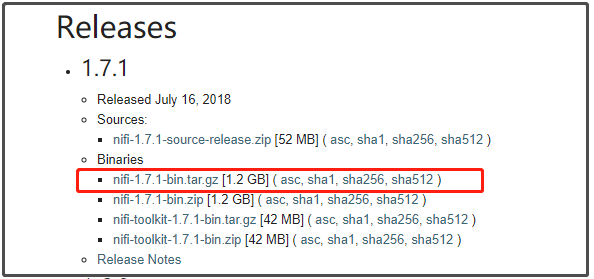
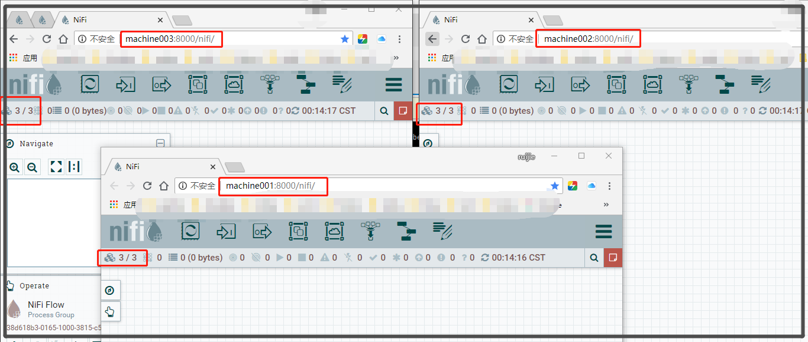

## 单机版安装

### NIFI下载

地址：<http://nifi.apache.org/download.html>



### 解压

下载完成后解压。（在linux中解压，解压后上传到linux系统的话有些文件会存在读写权限的问题）

### 配置

修改端口号和路径：

```properties
#conf/nifi.properties
#启动后访问的地址:
nifi.web.http.host=node4
#访问端口
nifi.web.http.port=8080
```

### 启动

```shell
bin/nifi.sh start  #启动命令
bin/nifi.sh stop   #关闭命令
bin/nifi.sh status #查看运行状态
```

### 访问

<http://192.168.23.133:8080/nifi>/


## 集群搭建

### Zookeeper安装

下载，解压

配置

启动

简单操作验证

> 注， NiFi有集成的Zookeeper， 可以不在单独安装， 而是通过NiFi配置启用内置zookeeper服务；

### NiFi集群配置


#### 配置

##### 方式一： 使用NiFi集成的zookeeper

###### conf/zookeeper.properties

```properties
clientPort=2188
initLimit=10
autopurge.purgeInterval=24
syncLimit=5
tickTime=2000
dataDir=./state/zookeeper
autopurge.snapRetainCount=30

server.1=machine001:3888:4888
server.2=machine002:3888:4888
server.3=machine003:3888:4888
```

执行脚本（zookeeper不同节点需要不同id）

```shell
#第一个节点
cd $NIFI_HOME
mkdir state
mkdir state/zookeeper
echo 1 > state/zookeeper/myid
#第二个节点
cd $NIFI_HOME
mkdir state
mkdir state/zookeeper
echo 2 > state/zookeeper/myid
#第三个节点
cd $NIFI_HOME
mkdir state
mkdir state/zookeeper
echo 3 > state/zookeeper/myid
```

###### conf/nifi.properties

```properties
####################
# State Management #
####################
nifi.state.management.configuration.file=./conf/state-management.xml
nifi.state.management.provider.local=local-provider
nifi.state.management.provider.cluster=zk-provider
nifi.state.management.embedded.zookeeper.start=true
nifi.state.management.embedded.zookeeper.properties=./conf/zookeeper.properties

# web properties #
nifi.web.http.host=machine001 
#nifi.web.http.host=machine002
#nifi.web.http.host=machine003
nifi.web.http.port=8000

# cluster node properties (only configure for cluster nodes) #
nifi.cluster.is.node=true
nifi.cluster.node.address=machine001 
#nifi.cluster.node.address=machine002 
#nifi.cluster.node.address=machine003 
nifi.cluster.node.protocol.port=9998
nifi.cluster.flow.election.max.wait.time=20 sec
nifi.cluster.flow.election.max.candidates=1
# zookeeper properties, used for cluster management #
nifi.zookeeper.connect.string=machine001:2188,machine002:2188,machine003:2188
nifi.zookeeper.connect.timeout=3 secs
nifi.zookeeper.session.timeout=3 secs
nifi.zookeeper.root.node=/nifi

```

###### conf/state-management.xml

```xml
<cluster-provider>
<id>zk-provider</id>
<class>org.apache.nifi.controller.state.providers.zookeeper.ZooKeeperStateProvider</class>
<property name="Connect String">machine001:2188,machine002:2188,machine003:2188</property>
<property name="Root Node">/nifi</property>
<property name="Session Timeout">10 seconds</property>
<property name="Access Control">Open</property>
</cluster-provider>
```

##### 方式二： 使用外部zookeeper

思路： 与集成集群配置方法类似， 需要注意：

###### conf/zookeeper.properties

```properties
clientPort=2188
initLimit=10
autopurge.purgeInterval=24
syncLimit=5
tickTime=2000
dataDir=./state/zookeeper
autopurge.snapRetainCount=30
#使用外部ZK组件，NiFi不需要启动ZK服务
#server.1=machine001:3888:4888
#server.2=machine002:3888:4888
#server.3=machine003:3888:4888
server.1=
```

###### conf/nifi.properties

```properties
####################
# State Management #
####################
#nifi.state.management.embedded.zookeeper.start=true
nifi.state.management.embedded.zookeeper.start=false
# zookeeper properties, used for cluster management #
#该属性值应填写外部zk组件的实际地址
nifi.zookeeper.connect.string=machine001:2188,machine002:2188,machine003:2188


```

###### conf/state-management.xml

```xml
<!--该属性值应填写外部zk组件的实际地址-->
<property name="Connect String">machine001:2188,machine002:2188,machine003:2188</property>

```

##### 

#### 启动

```shell
bin/nifi.sh start  #启动命令
bin/nifi.sh stop   #关闭命令
bin/nifi.sh status #查看运行状态
```


#### 验证部署情况

如下图，各节点都能访问到



> 疑问： 
>
> 此处三个节点都能访问，那么如何来控制同步？与架构图页不相符？
>
> 


#### 问题及处理方式


##### 问题一：

场景： 启动过程中node1，node2， 但是node3出现启动失败，进程被自动kill；

查找原因： 通过`$NIFI_HOME/logs/nifi-bootstrap.log`发现，9999端口再node3已经被nginx占用！！！导致无法启动RunNiFi进程

处理办法： 重新调整nifi.properties配置文件

`nifi.cluster.node.protocol.port=9999`改为

`nifi.cluster.node.protocol.port=9998`


##### 问题二：

场景: node1,2 正常启动，但是打开http://machine002:8000/nifi/ 发现进不去，一直处于 `Cluster is still in the process of voting on the appropriate Data Flow. `提示页面

原因： 详见官方文档[Clustering Configuration](https://nifi.apache.org/docs/nifi-docs/html/administration-guide.html#clustering)小节中对**Flow Election** 的描述部分

解决方式：configured by setting the `nifi.cluster.flow.election.max.wait.time` ， `nifi.cluster.flow.election.max.candidates`  property ，remove a node’s `flow.xml.gz` file and restart the node 

> I Have faced similar error. In my case Nifi was running fine but in cluster, nodes was not connected. In nifi-app.log found below errors.
>
> ```
> ERROR [Curator-Framework-0] o.a.c.f.imps.CuratorFrameworkImpl Background retry gave uporg.apache.curator.CuratorConnectionLossException: KeeperErrorCode = ConnectionLoss
> ```
>
> Solution - ZK services was not running. I have started first then started Nifi cluster. Now Nifi nodes are connected properly in a cluster and cluster is running fine.


##### 问题解决重要途径

###### 1 查看日志文件解决问题：

 `$NIFI_HOMEconf/nifi-app.log `

 `$NIFI_HOMEconf/nifi-user.log `

 `$NIFI_HOME/logs/nifi-bootstrap.log`

###### 2 调试模式，详细日志信息

如果方法1未能解决，可以通过以下方式`$NIFI_HOME/conf/logback.xml`. Specifically, set the level="DEBUG" in the following line (instead of "INFO"):

```xml
    <logger name="org.apache.nifi.web.api.config" level="INFO" additivity="false">
        <appender-ref ref="USER_FILE"/>
    </logger>
```

3 启动日志跟踪

`tail -f $NIFI_HOME/logs/nifi-app.log`


> 参考 [NIFI 集群配置 Clustering Configuration](https://www.jianshu.com/p/50e712a4499b)

