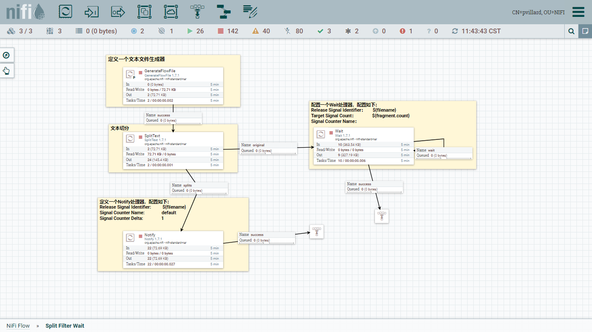
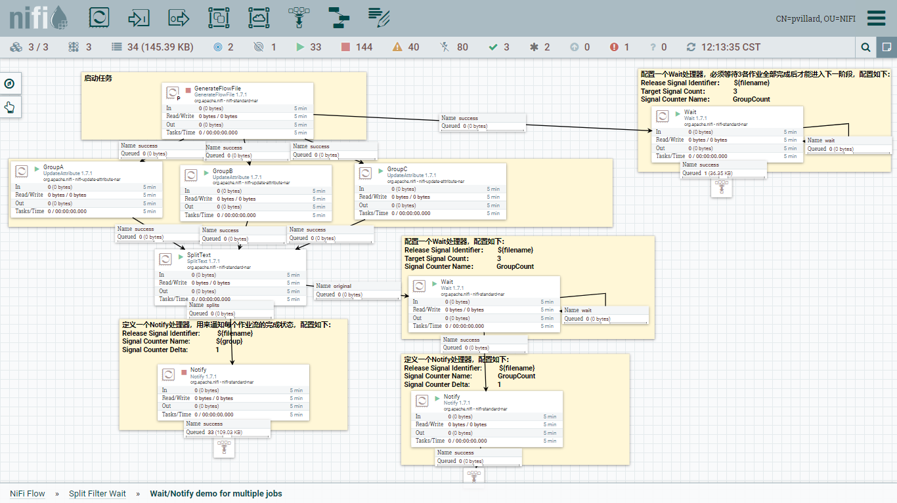

# 如何在NiFi中实现多个作业流间的调度计划(Wait/Notify)

## 需求背景

 stage → load datavault

## 解决办法

NiFi现有的`Schedule`仅支持基于`流文件(FileFlow)`的`Proccessor层面`的定时任务，当遇到多个作业间的任务衔接时(可理解为group与group间的调度关系)，NiFi并没有提供比较直接的处理方式。

不过通过对NiFi中提供的`Wait`与`Notify`两个Proccessor应用，可以有效实现这种调度需求。(重点在于定义出作业的`Completed`状态)

## 知识准备

### Wait Proccessor 

| Proccessor            | Property                |  Comment                                               | 个人理解                   |
| --------------------- | ----------------------- |  ----------------------------------------------------- | -------------------------------- |
| Wait| ReleaseSignalIdentifier | A value to determine the release signal cache key | 用于定义目标键值， 当`SignalCounterName`属性为空时，处理器会根据本属性定义的键即`${ReleaseSignalIdentifier}`到DistributedMapCache服务（以下简称DMC）中值，并与TargetSingalCount做比较，如：`${fragment.identifier}`；  当`SignalCounterName`属性不为空时，则本属性相当于定义一个父节点实际，处理器会根据`${ReleaseSignalIdentifier}.${SignalCounterName}`如：作为键，到DMC中获值来与`TargetSignalCount`作比较，如：`${filename}` |
| Wait| TargetSignalCount       | A value to determine the target signal count. This processor checks whether the signal count has reached this number. **If Signal Counter Name is specified**, this processor checks a particular counter, **otherwise** checks against total count in a signal. | 临界条件，当DMC服务中对应的signal count 到达本实行定义的值时，才会放行，如：${fragment.count} |
| Wait| SignalCounterName       | A value, or the results of an Attribute Expression Language statement, which will be evaluated against a FlowFile in order to determine the signal counter name. If not specified, this processor checks the total count in a signal. | 属于SignalID的子节点，不填的话，默认为SignalID，如： chunks |
| Wait| WaitBufferCount         |                                                        | 1                                |

### Notify Proccessor

| Proccessor | Property                | Comment                                                      | 个人理解                                                     |
| ---------- | ----------------------- | ------------------------------------------------------------ | ------------------------------------------------------------ |
| Notify     | ReleaseSignalIdentifier | A value to determine the release signal cache key            | 向服务器注册一个释放信号`ReleaseSignalID`${fragment.identifier}，并根据`SignalCounterDelta`所定义的规则迭代更新该值；（类似`wait`处理器，可以`SignalCounterName`组成父子节点关系） |
| Notify     | SignalCounterName       | A value, or the results of an Attribute Expression Language statement, which will be evaluated against a FlowFile in order to determine the signal counter name. Signal counter name is useful when a corresponding Wait processor needs to know the number of occurrences of different types of events, such as success or failure, or destination data source names, etc. | 向DMC注册SignalCounterName(子计数节点)                       |
| Notify     | SignalCounterDelta      | A value, or the results of an Attribute Expression Language statement, which will be evaluated against a FlowFile in order to determine the signal counter delta. Specify how much the counter should increase. For example, if multiple signal events are processed at upstream flow in batch oriented way, the number of events processed can be notified with this property at once. Zero (0) has a special meaning, it clears target count back to 0, which is especially useful when used with Wait Releasable FlowFile Count = Zero (0) mode, to provide 'open-close-gate' type of flow control. One (1) can open a corresponding Wait processor, and Zero (0) can negate it as if closing a gate. | 定义迭代步长，如${record.count}                              |

### DistributedMapCacheServer

Provides a map (key/value) cache that can be accessed over a socket. Interaction with this service is typically accomplished via a DistributedMapCacheClient service.(个人理解，这个服务器提供的功能类似Zookeeper；)

### DistributedMapCacheServiceClint

Provides the ability to communicate with a DistributedMapCacheServer. This can be used in order to share a Map between nodes in a NiFi cluster.(配置客户端，为proccessor提供访问DistributedMapCacheServer服务方法；)

## Wait/Notify入门demo

### 思路

- 1.生成文本文件(总任务)

- 2.根据记录数，每100行切为一个文件 
  - 2.1 Wait等待所有切片任务执行完毕   -->进行后续任务
  - 2.2 ${此处可以执行业务逻辑，本案例中不做操作}-->Notify 将所有切片任务的完成情况提交到DMC。

## 分层控制Demo

### 思路

- 1.生成文本文件(总任务) -->Wait监听子任务完成情况，等待下一个批次任务

- 2.执行分组任务
- 3.各分组执行业务逻辑
  - 3.1 Wait监听切分任务,每个切分任务完成后-->Notify通知各个子任务完成后
  - 3.2Notify 将所有切片任务的完成情况