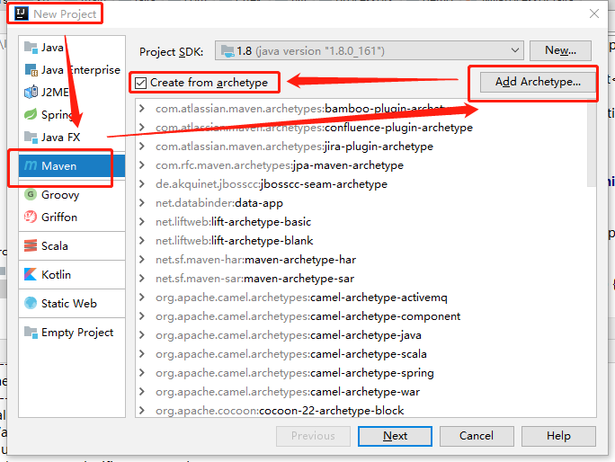
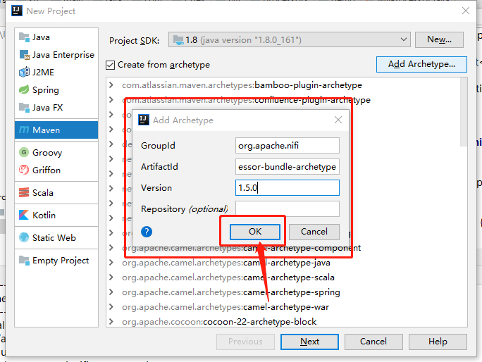
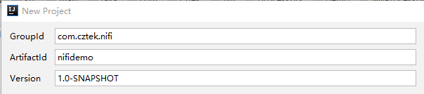
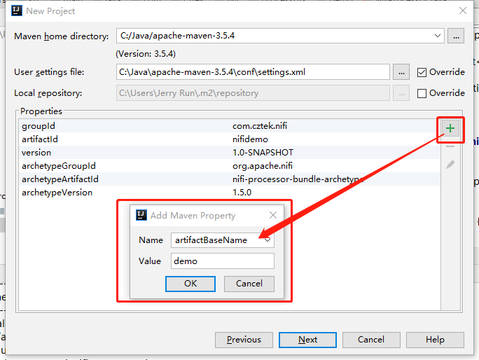
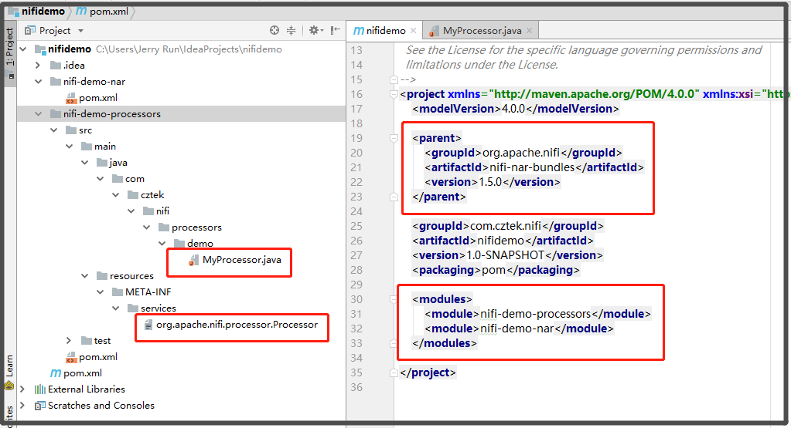

# NiFi Processor开发--使用IDEA构建NiFi项目

## 1. 环境准备：

Maven 3.5.x

Java 1.8

> 注：阿里云maven库中archetype-catalog.xml有问题， 详见：
>
> [使用ALIYUN作为MAVEN源](http://softlab.sdut.edu.cn/blog/subaochen/2017/05/%E4%BD%BF%E7%94%A8aliyun%E4%BD%9C%E4%B8%BAmaven%E6%BA%90/)
>
> 可选用其他仓库，如：<http://maven.wso2.org/nexus/content/groups/public/>
>
> 详见：[推荐几个国内访问比较快的Maven仓库镜像](https://www.iteblog.com/archives/2022.html)

## 2. Archetype 选择

New Project --> Maven --> Create from archetype --> Add Archetype



```properties
Archetype Group Id=org.apache.nifi

Archetype Artifact Id=nifi-processor-bundle-archetype

Archetype Version=1.5.0
```




## 3. 构建项目





```properties
#artifactBaseName 属性在后面构建项目前需要加进来
artifactBaseName=demo  
```

## 4. 项目结构



### pom.xml 

```xml
<?xml version="1.0" encoding="UTF-8"?>
<!--
  Licensed to the Apache Software Foundation (ASF) under one or more
  contributor license agreements. See the NOTICE file distributed with
  this work for additional information regarding copyright ownership.
  The ASF licenses this file to You under the Apache License, Version 2.0
  (the "License"); you may not use this file except in compliance with
  the License. You may obtain a copy of the License at
  http://www.apache.org/licenses/LICENSE-2.0
  Unless required by applicable law or agreed to in writing, software
  distributed under the License is distributed on an "AS IS" BASIS,
  WITHOUT WARRANTIES OR CONDITIONS OF ANY KIND, either express or implied.
  See the License for the specific language governing permissions and
  limitations under the License.
-->
<project xmlns="http://maven.apache.org/POM/4.0.0" xmlns:xsi="http://www.w3.org/2001/XMLSchema-instance" xsi:schemaLocation="http://maven.apache.org/POM/4.0.0 http://maven.apache.org/xsd/maven-4.0.0.xsd">
    <modelVersion>4.0.0</modelVersion>

    <parent>
        <groupId>org.apache.nifi</groupId>
        <artifactId>nifi-nar-bundles</artifactId>
        <version>1.5.0</version>
    </parent>

    <groupId>com.cztek.nifi</groupId>
    <artifactId>nifidemo</artifactId>
    <version>1.0-SNAPSHOT</version>
    <packaging>pom</packaging>

    <modules>
        <module>nifi-demo-processors</module>
        <module>nifi-demo-nar</module>
    </modules>

</project>

```


## 参考

[nifi：使用eclipse开发自己的nifi processor](https://blog.csdn.net/scujinxiang/article/details/79072977)

[使用ALIYUN作为MAVEN源](http://softlab.sdut.edu.cn/blog/subaochen/2017/05/%E4%BD%BF%E7%94%A8aliyun%E4%BD%9C%E4%B8%BAmaven%E6%BA%90/)

[Build Custom Nifi Processor](https://community.hortonworks.com/articles/4318/build-custom-nifi-processor.html)