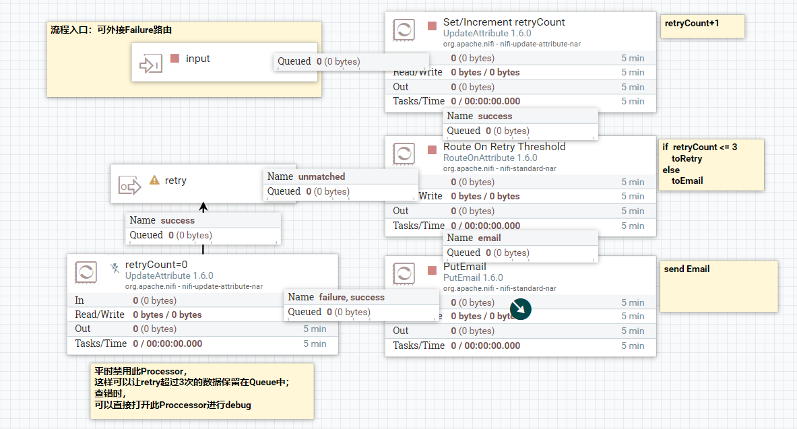

# NiFi作业异常监控

### 1 整体流程：

UpdateAttribute(赋值retryCount，每次重试就+1)

-> RouteOnAttribute(条件控制，当重试次数retryCount>3，则发邮件提示，否则输出到retry重试路由)

->PutEmail(发邮件模板)

->UpdateAttribute(赋值retryCount=0，此处理器在Debug时才会开启，平时处于禁用状态即可)

### 1.2 流程图：

## 3.资源附件

### 

## 4.引用文档：

[NiFi Error Handling - Design Pattern](https://community.hortonworks.com/articles/76598/nifi-error-handling-design-pattern-1.html)

[NiFi best practices for error handling](https://community.hortonworks.com/questions/77336/nifi-best-practices-for-error-handling.html)

