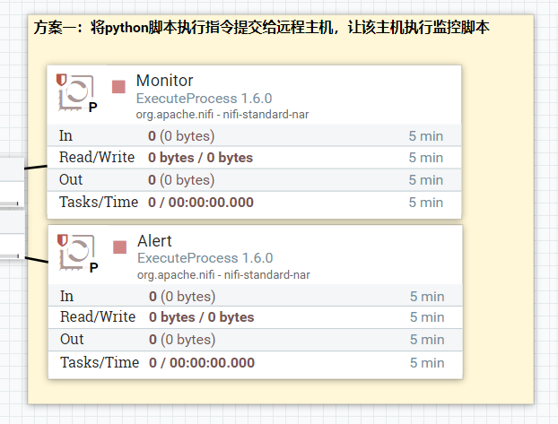
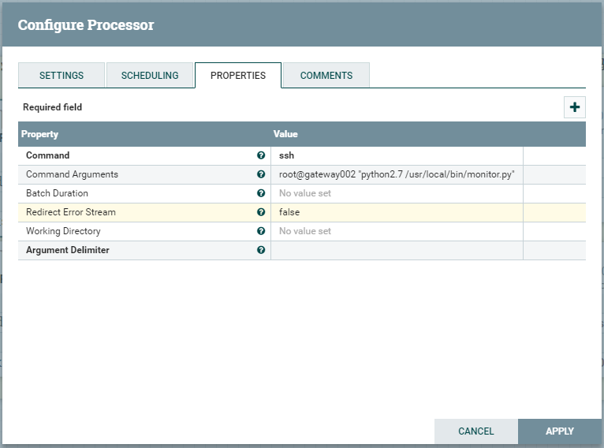
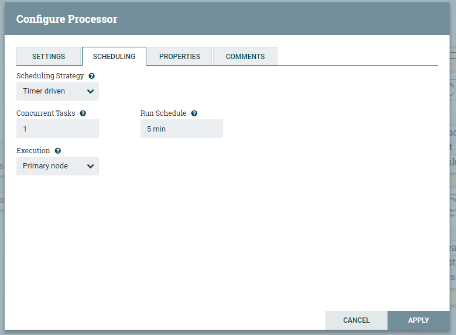
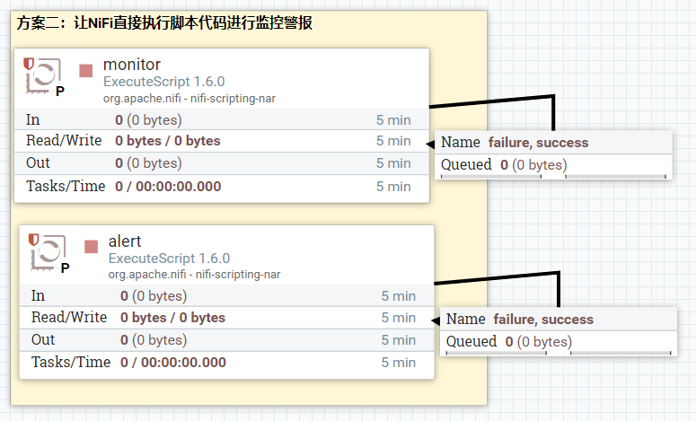
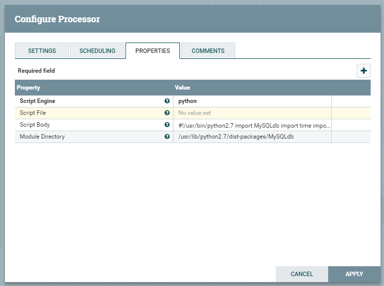
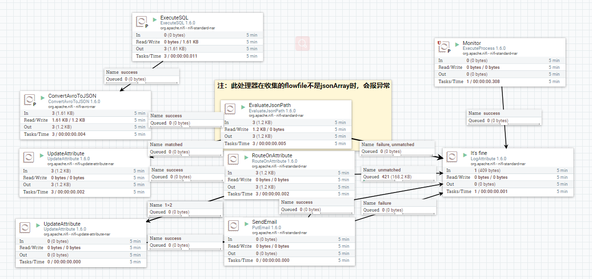
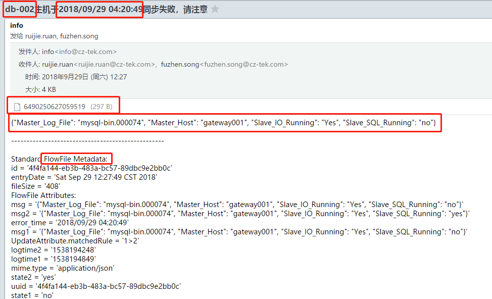
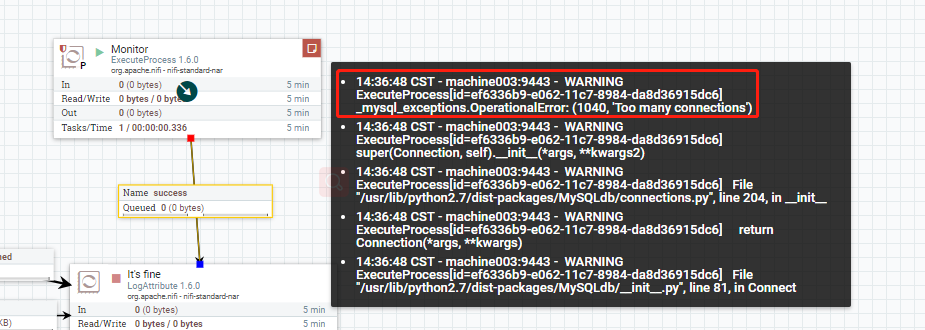

# NiFi监控Mysql GTID主从备份状态

方案一：在NiFi上定时发出shell指令到主机，让主机执行监控警报脚本

方案二：直接在NiFi上执行脚本

方案三：不使用脚本，直接通过NiFi监控


## 方案一：shell指令到主机

### 流程图



### 配置及说明：

|tab| Property | value | 备注 |
| ---------- | ----- | ---- | ---- |
| PROPERTIES | Command | ssh |指定指令运行程序|
| PROPERTIES | Command Arguments | root@gateway002 "python2.7 /usr/local/bin/monitor.py" |远程执行脚本|
| SCHEDULING | Run Schedule | 5 min |定时5分钟执行一次|
| SCHEDULING | Execution | Primary node |只需要主节点执行即可，不需要整个集群去跑|







## 方案二：NiFi上执行脚本

### 流程图





### 配置及说明：




#### **monitor.py**

```python
#!/usr/bin/python2.7
#coding:utf-8
import MySQLdb
 
import time
 
import datetime
 
import json
 
 
 
 
## 插入采集的信息
 
def insert_message(msg_from, msg_data, log_time):
 
    conn = MySQLdb.connect(host='gateway001',user='root',passwd='123456@',db='nifi_db',port=3306)
 
    cur=conn.cursor()
 
    try:
 
        sql = "insert into message (msg_from, msg_data, log_time) values('%s', '%s', %d)" % (msg_from, msg_data, log_time)
 
        cur.execute(sql)
 
        conn.commit()
 
    finally:
 
        cur.close()
 
        conn.close()
 
 
 
 
## 获取mysql同步状态
 
def get_replica_status():
 
    conn = MySQLdb.connect(host='localhost',user='root',passwd='123456@',port=3306)
 
    cur=conn.cursor()
 
    result = {}
 
    try:
 
        cur.execute("show slave status")
 
        res=cur.fetchall()
 
#        print res
 
        result["Master_Host"] = res[0][1]
 
        result["Master_Log_File"] = res[0][5]
 
        result["Slave_IO_Running"] = res[0][10]
 
        result["Slave_SQL_Running"] = res[0][11]
 
    finally:
 
        cur.close()
 
        conn.close()
 
    return result
 
 
 
 
def main():
 
#    print ""
 
#    print "-- begin script. %s --" % datetime.datetime.now()
 
    status_result = get_replica_status()
 
#    print status_result
 
    insert_message("db-002", json.dumps(status_result), int(time.time()))
 
#    print "-- end script. %s --" % datetime.datetime.now()
 
#    print ""
 
 
 
 
if __name__ == '__main__':
 
    main()
```

#### **alert.py**

```python
#!/usr/bin/python2.7
# -*- coding: utf-8 -*-
 
import MySQLdb
import time
import datetime
import json
import smtplib
 
 
 
 
EMPTY_TOLERANCE_SECONDS = 350
 
TO_ADDR = ["ruijie.ruan@cz-tek.com","fuzhen.song@cz-tek.com"]
 
FROM_ADDR = "info@cz-tek.com"
 
MAIL_PASSWORD = "Brilliantech123@"
 
 
 
 
DB_HOST = "gateway001"
 
DB_USER = "root"
 
DB_PASSWORD = "123456@"
 
DB_NAME = "nifi_db"
 
DB_PORT = 3306
 
 
 
 
#选取采集的信息的最后一条
 
def select_last_mysql_status():
 
    conn = MySQLdb.connect(host=DB_HOST,user=DB_USER,passwd=DB_PASSWORD,db=DB_NAME,port=DB_PORT)
 
    cur=conn.cursor(MySQLdb.cursors.DictCursor)
 
    result = None
 
    try:
 
        sql = "select * from message order by log_time desc limit 1"
 
        cur.execute(sql)
 
        res=cur.fetchall()
 
        print res
 
        if (len(res) > 0):
 
            result = res[0]
 
    finally:
 
        cur.close()
 
        conn.close()
 
    return result
 
 
 
 
 
 
 
def adjust_result(result):
 
    ## 没有查询到任何message
 
    if result is None:
 
        return "没有查询到任何message"
 
    ## 检查log_time
 
    log_time = result["log_time"]
 
    diff_seconds = diff_seconds_to_now(log_time)
 
    if diff_seconds > EMPTY_TOLERANCE_SECONDS:
 
        last_time = format_time(log_time)
 
        return "message中没有新采集的数据产生，上一条的数据采集点是%s" % last_time
 
    ## 检查Slave_IO_Running和Slave_SQL_Running
 
    Slave_IO_Running = json.loads(result["msg_data"])["Slave_IO_Running"]
 
    Slave_SQL_Running = json.loads(result["msg_data"])["Slave_SQL_Running"]
 
    if Slave_IO_Running != "Yes" or Slave_SQL_Running != "Yes":
 
        return "Slave_IO_Running: %s, Slave_SQL_Running: %s " % (Slave_IO_Running, Slave_SQL_Running)
 
    return None
 
 
 
 
 
 
 
## 格式化时间
 
def format_time(timeStamp):
 
    import time
 
    timeArray = time.localtime(timeStamp)
 
    otherStyleTime = time.strftime("%Y/%m/%d %H:%M:%S", timeArray)
 
    return otherStyleTime
 
 
 
 
 
 
 
## 计算秒数的差值
 
def diff_seconds_to_now(before):
 
    import time
 
    return int(time.time()) - before
 
  
 
## 发送邮件
 
def sendmail(to_addrs, title, body):
 
    server = smtplib.SMTP('smtp.exmail.qq.com', 587)
 
    server.set_debuglevel(1)
 
    server.starttls()
 
    server.login(FROM_ADDR, MAIL_PASSWORD)
 
    server.sendmail(FROM_ADDR, to_addrs, "From:%s\nTo:%s\nSubject: %s\n\n%s" % (FROM_ADDR, ", ".join(to_addrs), title, body))
 
    server.quit()
 
 
 
 
 
 
 
def main():
 
    result = select_last_mysql_status()
 
    try:
 
        error_message = adjust_result(result)
 
        if error_message is not None:
 
            print error_message
 
            ## sendmail
 
            print "send error mail(1)"
 
            sendmail(TO_ADDR, "[ERROR] mysql replica maybe failed", error_message)
 
        else:
 
            print "everything seems OK"
 
    except Exception as inst:
 
        ## sendmail
 
        print inst
 
        print "send error mail(2)"
 
        sendmail(TO_ADDR, "[ERROR] mysql replica maybe failed", inst)
 
 if __name__ == '__main__':
 
    print ""
 
    print "-- begin script. %s --" % datetime.datetime.now()
 
    main()
 
    print "-- end script. %s --" % datetime.datetime.now()
 
    print ""
```


## 方案三：NiFi获取相关信息并发出警报(不通过脚本)

设计思路：

1. 每次获取两条监控记录
2. newer状态为no，older状态为yes，则发警报
3. 其他情况（no+no、yes+no、yes+yes）不发警报

> 注：警报频率高于记录频率，所以no+no的情况下，已发出过警报（本例alter/2min、monitor/5min）


### 流程图：





### 处理器配置：

| Processor         | 功能说明                                     |
| ----------------- | -------------------------------------------- |
| ExecuteSQL        | 获取Mysql同步状态记录信息                    |
| ConvertAvroToJson | 格式转换                                     |
| EvaluateJsonPath  | 提取属性，如logtime,host,state等信息         |
| RouteOnAttribute  | 分析流文件属性，指定路由（类似if..else功能） |
| UpdateAttribute   | 提取分析结果，赋值邮件提醒所需相关属性       |
| PutEmail          | 发送邮件                                     |

RouteOnAttribute中的EL表达式
```elixir
${logtime2:gt(${logtime1}):and(${state2:equalsIgnoreCase('No')}):and(${state1:equals(${state2}):not()})}

${logtime1:gt(${logtime2}):and(${state1:equalsIgnoreCase('No')}):and(${state1:equals(${state2}):not()})}
```

### 邮件信息：





## 注意事项

问题一：引用库问题

本例中，python2.7依赖的MySQL库无法引用，故本案例中方案二未实现。可通过其他脚本，或引入其他可用库来实现；

> 详情可参看：
>
> [Import Modules in Nifi ExecuteScript](https://stackoverflow.com/questions/40719469/import-modules-in-nifi-executescript)
>
> [How to add python modules ?](http://apache-nifi.1125220.n5.nabble.com/How-to-add-python-modules-td5491.html)
>
> [How to add additional libraries in ExecuteScript Processor for Python](https://community.hortonworks.com/questions/75921/how-to-add-additional-libraries-in-executescript-p.html)


问题二：

方案一、二可以通过对alert执行频率可以通过反压来控制邮件发送频率；

问题三：

跑脚本的方式会出现MySQL连接不够用的情况，导致无法执行脚本，如图：



