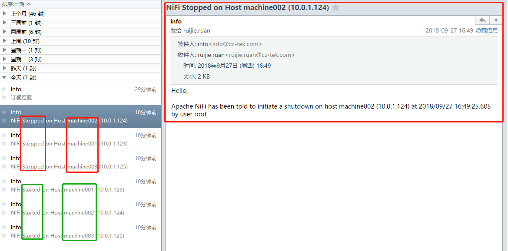

# NiFi邮件提醒--start/stop/dead

## 1. 调整 NiFi配置文件

### 1.1 概述：

 启用NiFi邮件提醒，需要调整两个配置文件：

1. **bootstrap.conf**(`${nifi_home}/conf/bootstrap.conf`)
2. **bootstrap-notification-services.xml**(`${nifi_home}/conf/bootstrap-notification-services.xml`)

#### 1.1.1 bootstrap.conf

```
nifi.start.notification.services=email-notification
nifi.stop.notification.services=email-notification
nifi.dead.notification.services=email-notification
```


#### 1.1.2 bootstrap-notification-services.xml 

> make sure your SMTP settings are updated, and are uncommented. 
>
> Sample configuration is given below:

```xml
<service>
	<id>email-notification</id>
	<class>org.apache.nifi.bootstrap.notification.email.EmailNotificationService</class>
	<property name="SMTP Hostname">west.xxxx.server.net</property>
	<property name="SMTP Port">587</property>
	<property name="SMTP Username">jgeorge@hortonworks.com</property>
	<property name="SMTP Password">Th1sisn0tmypassw0rd</property>
	<property name="SMTP TLS">true</property>
	<property name="From">jgeorge@hortonworks</property>
	<property name="To">jgeorge@hortonworks.com</property>
</service>
```


## 2. 测试 NiFi Notification Services

### 2.1. 重启集群

> Once restarted, you will see both stopped and started alerts in your inbox with details.

```she&#39;l&#39;l
/opt/nifi-1.6.0/bin/nifi.sh restart && tail -f /opt/nifi-1.6.0/logs/nifi-app.log
```




### 2.2. 强杀进程

> Try out stopping and killing NiFi process [make sure you don’t kill bootstrap process which monitors NiFi which in turn restarts NiFi process.] Died Email Alert:


## 3. 参考文档

[Hontornwork HDF Notification Services](https://community.hortonworks.com/articles/80756/hdf-20-nifi-notification-services.html)

[NiFi notification_services](https://nifi.apache.org/docs/nifi-docs/html/administration-guide.html#notification_services)