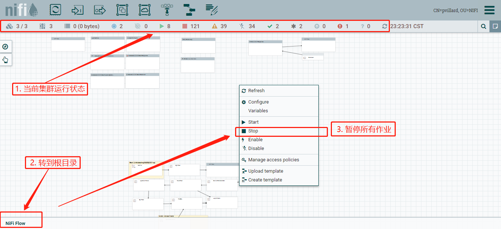
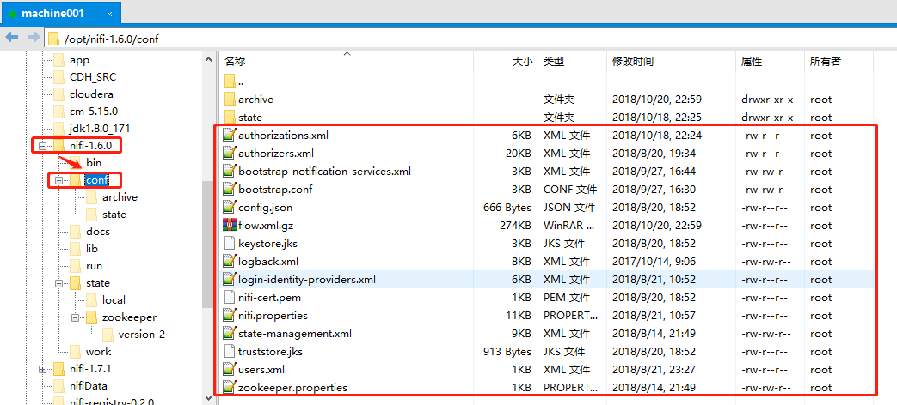
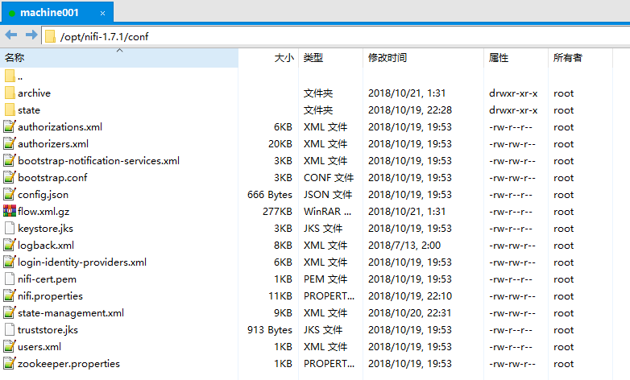
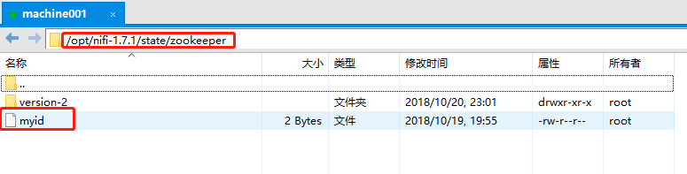
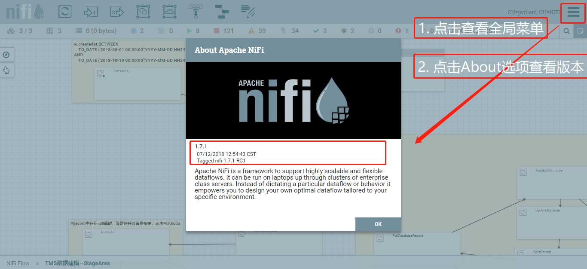

# NiFi集群升级

## 1. 现有集群(旧版本)

### 1.1 停止所有作业

可在NiFi用户界面，根目录下，右击菜单中点击Stop

> 


### 1.2 停止集群运行

在集群所有节点中执行以下指令，停止集群运行

```bash
<NIFI_HOME>/bin/nifi.sh stop #停止nifi运行(NIFI_HOME为实例安装位置，如本例运行：/opt/nifi-1.6.0/bin/nifi.sh)
```

> 情况一: 如果集群中没有处理中的数据，则可以直接无视旧集群中的数据（即NIFI_HOME下的所有`repository`目录）；
>
> 情况二：但是，如果集群中存在正在处理的数据（暂停状态的作业数据），则需要注意后续nifi.properties中相关属性的目录位置；
>
> NiFi最佳实践中提倡，将`repository`以及一些Resource类的文件夹独立存放，这样有利于版本升级时，无需再关注这些文件；详情可参考NiFi Administrator Guide 中的指导方式，或者简要参考： [1.x.0 to 1.x.0 Upgrade](https://cwiki.apache.org/confluence/display/NIFI/1.x.0+to+1.x.0+Upgrade) 该文档；
>
> 本例中，所有作业都处于空闲状态，即整个集群的queue队列为空，集群中没有处理中的数据，故不在此赘述中间文件的迁移。
>
>

### 1.3 需要迁移的文件及配置属性

#### 1.3.1 NiFi配置文件

在旧集群中，`cd NIFI_HOME/conf`可以看到一下文件及文件夹，本路径下包含的配置文件比较多，各文件的作用我在以下做一个简要说明：



```bash
root@machine001:~# cd /opt/nifi-1.6.0/conf
root@machine001:/opt/nifi-1.6.0/conf# ll
archive/ #
state/ #作业同步状态
authorizations.xml #隶属 authorizers.xml
authorizers.xml #用户访问及作业操作权限相关配置
users.xml #隶属 authorizers.xml
bootstrap.conf #集群启动配置
bootstrap-notification-services.xml #隶属bootstrap.conf，定义集群启动/宕机/停止操作时提醒操作
config.json #证书相关
flow.xml.gz #作业流配置
keystore.jks #证书相关
logback.xml #日志相关
login-identity-providers.xml #用户登陆相关，用于配置LDAP，Kerberos等登陆服务配置
nifi-cert.pem #证书相关
nifi.properties #NiFi核心配置
state-management.xml #状态管理，主要用于配置Zookeeper（客户端）
truststore.jks #证书相关
zookeeper.properties #配置Zookeeper，负责配置内部集成的Zookeeper服务
```

> 注意：
>
> 简单起见，本例对配置文件`nifi.properties`只做简单拷贝操作,所以，再拷贝之后，需要注意的是文件中写死的属性需要做一下调整，例如：
>
> ```bash
> nifi.security.keystore=/opt/nifi-1.6.0/conf/keystore.jks
> nifi.security.truststore=/opt/nifi-1.6.0/conf/truststore.jks
> ```
>
> 将以上属性调整为：
>
> ```bash
> nifi.security.keystore=./conf/keystore.jks
> nifi.security.truststore=./conf/truststore.jks
> ```
>
> NiFi最佳实践中，推荐是将配置文件`nifi.properties`中的属性拷贝出来到新集群的配置中。

#### 1.3.2 Zookeeper节点id配置

将`NIFI_HOME/state/zookeeper`路径下的`id`拷贝到新版本的NiFi实例中


## 2. 新版本NiFi实例

### 2.1 下载新版本

到[NiFi官网下载](https://nifi.apache.org/download.html)新版本：[nifi-1.7.1-bin.tar.gz](https://www.apache.org/dyn/closer.lua?path=/nifi/1.7.1/nifi-1.7.1-bin.tar.gz)

### 2.2 NiFi安装

下载最新版本NiFi, 同步到各个节点，执行解压缩，如本例中`/opt/nifi-1.7.1-bin.tar.gz`为安装包下载好的路径：

```Bash
tar -zxvf /opt/nifi-1.7.1-bin.tar.gz -C /opt/ #解压安装包
scp /opt/nifi-1.7.1-bin.tar.gz machine001:/opt/ #执行远程拷贝，将安装包拷贝到集群各个节点
ssh machine002 'tar -zxvf /opt/nifi-1.7.1-bin.tar.gz -C /opt/' #远程解压
```

### 2.3 配置文件拷贝

将1.3中准备的文件拷贝到新版本NiFi实例中，

1. `NiFi_HOME/conf/`下所有文件
2. `NIFI_HOME/state/zookeeper`下的`id`文件

> 注：新的实例中没有`./state/zookeeper`文件夹，可先执行`mkdir /opt/nifi-1.7.1/state/zookeeper`，再执行拷贝操作





## 3.完成集群升级

启动新集群，并查看运行状态

`/opt/nifi-1.7.1/bin/nifi.sh start && tail -f /opt/nifi-1.7.1/logs/nifi-app.log #启动集群并查看日志`

正常启动后，登陆用户界面，查看NiFi集群版本：

> 


> 此处可能出现用户证书不可用的情况，可以删除现有证书，重新导入证书即可

## Reference

> [How to upgrade to latest Nifi version ?](https://community.hortonworks.com/questions/194071/how-to-upgrade-to-latest-nifi-version.html)

> [1.x.0 to 1.x.0 Upgrade](https://cwiki.apache.org/confluence/display/NIFI/1.x.0+to+1.x.0+Upgrade)

