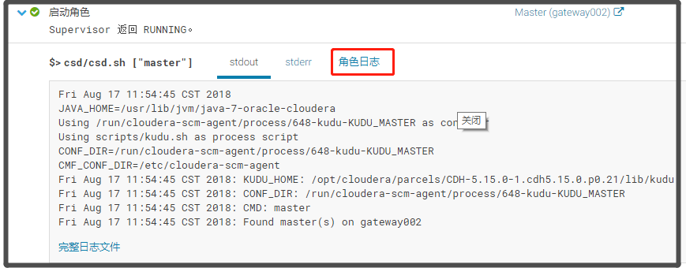

## Objective

This tutorial demonstrates how to use the **QueryDatabaseTable** and **PutKudu** processors to read data from a MySQL database and put into Kudu. Thanks to [@Cam Mach](https://community.hortonworks.com/users/18581/cammach.html) for his assistance with this article.

**Note:** The PutKudu processor was introduced in NiFi 1.4.0.

## Environment

This tutorial was tested using the following environment and components:

Mac OS X 10.11.6

 

Apache NiFi 1.4.0

 

Apache Kudu 1.5.0

 

MySQL 5.7.13

## PutKudu (AvroReader)

### Demo Configuration

#### MySQL Setup

##### Create table

Create the table 'users' In your MySQL instance, choose a database ("nifi_db" in my instance) and create the table "users":

```mysql
unix> mysql -u root -p
unix> Enter password:<enter>
mysql> use nifi_db;
mysql>CREATE TABLE `users` (
  `id` mediumint(9) NOT NULL AUTO_INCREMENT,
  `title` text,
  `first_name` text,
  `last_name` text,
  `street` text,
  `city` text,
  `state` text,
  `zip` text,
  `gender` text,
  `email` text,
  `username` text,
  `password` text,
  `phone` text,
  `cell` text,
  `ssn` text,
  PRIMARY KEY (`id`)
) ENGINE=InnoDB AUTO_INCREMENT=103 DEFAULT CHARSET=latin1;
```


##### Insert data 

Add data to the "users" table:

```mysql
mysql>INSERT INTO `users` (`id`, `title`, `first_name`, `last_name`, `street`, `city`, `state`, `zip`, `gender`, `email`, `username`, `password`, `phone`, `cell`, `ssn`)
VALUES (1, 'miss', 'marlene', 'shaw', '3450 w belt line rd', 'abilene', 'florida', '31995', 'F', 'marlene.shaw75@example.com', 'goldenpanda70', 'naughty', '(176)-908-6931', '(711)-565-2194', '800-71-1872'),
(2, 'ms', 'letitia', 'jordan', '2974 mockingbird hill', 'irvine', 'new jersey', '64361', 'F', 'letitia.jordan64@example.com', 'lazytiger614', 'aaaaa1', '(860)-602-3314', '(724)-685-3472', '548-93-7031'),
(3, 'mr', 'todd', 'graham', '5760 spring hill rd', 'garden grove', 'north carolina', '81790', 'M', 'todd.graham39@example.com', 'purplekoala484', 'paintball', '(230)-874-6532', '(186)-529-4912', '362-31-5248'),
(4, 'mr', 'seth', 'martinez', '4377 fincher rd', 'chandler', 'south carolina', '73651', 'M', 'seth.martinez82@example.com', 'bigbutterfly149', 'navy', '(122)-782-5822', '(720)-778-8541', '200-80-9087'),
(5, 'mr', 'guy', 'mckinney', '4524 hogan st', 'iowa park', 'ohio', '24140', 'M', 'guy.mckinney53@example.com', 'blueduck623', 'office', '(309)-556-7859', '(856)-764-9146', '973-37-9077'),
(6, 'ms', 'anna', 'smith', '5047 cackson st', 'rancho cucamonga', 'pennsylvania', '56486', 'F', 'anna.smith74@example.com', 'goldenfish121', 'albion', '(335)-388-7351', '(485)-150-6348', '680-20-6440'),
(7, 'mr', 'johnny', 'johnson', '7250 bruce st', 'gresham', 'new mexico', '83973', 'M', 'johnny.johnson73@example.com', 'crazyduck127', 'toast', '(142)-971-3099', '(991)-131-1582', '683-26-4133'),
(8, 'mrs', 'robin', 'white', '7882 northaven rd', 'orlando', 'connecticut', '40452', 'F', 'robin.white46@example.com', 'whitetiger371', 'elizabeth', '(311)-659-3812', '(689)-468-6420', '960-70-3399'),
(9, 'miss', 'allison', 'williams', '7648 edwards rd', 'edison', 'louisiana', '52040', 'F', 'allison.williams82@example.com', 'beautifulfish354', 'sanfran', '(328)-592-3520', '(550)-172-4018', '164-78-8160');
```


#### Kudu Setup

##### Find IP Addr

For my setup, I followed the [Apache Kudu Quickstart](https://kudu.apache.org/docs/quickstart.html) instructions to easily set up and run a Kudu VM.

To check that your VM is running:

```
unix> VBoxManage list runningvms"kudu-demo" {b39279b5-3dd6-478a-ac9d-2204bf88e7b9}
```

To see what IP Kudu is running on:

```
unix> VBoxManage guestproperty get kudu-demo /VirtualBox/GuestInfo/Net/0/V4/IPValue: 192.168.58.100
```

The Kudu web client runs on port 8051:


##### Create table

Create a table in Kudu by first connecting to Impala in the virtual machine:

```shell
ssh demo@quickstart.cloudera -t impala-shelldemo@quickstart.cloudera's password:[quickstart.cloudera:21000] >
```

( **Note**: The username and password for the Quickstart VM is "demo".)

Create the Kudu table with the same columns and data types as the MySQL table:

```sql
CREATE TABLE users_kudu
    (
    id BIGINT,
    title STRING,
    first_name STRING,
    last_name STRING,
    street STRING,
    city STRING,
    state STRING,
    zip STRING,
    gender STRING,
    email STRING,
    username STRING,
    password STRING,
    cell STRING,
    ssn STRING,
    PRIMARY KEY(id)
    )
    PARTITION BY HASH PARTITIONS 16
    STORED AS KUDU;
```


#### NiFi Flow Setup

Follow the following detailed instructions to set up the flow. Alternatively, a template of the flow can be downloaded here:[putkudu-querydatabasetable.xml](https://community.hortonworks.com/storage/attachments/41499-putkudu-querydatabasetable.xml)

##### Two Controller Services

Two controller services are needed for the flow. Click the "Configuration" button (gear icon) from the Operate palette:

###### DBCPConnectionPool


This opens the NiFi Flow Configuration window. Select the "Controller Services" tab. Click the "+" button and add a DBCPConnectionPool controller service:


Configure the controller service as follows (adjusting the property values to match your own MySQL instance and environment):


###### AvroReader

Next, add an AvroReader controller service:


Apply the default configuration:


Select the "lightning bolt" icon for each controller service to enable them:


##### QueryDatabaseTable processor:


Configure the processor as follows:


where:

The DBCPConnectionPool controller service created earlier is selected for Database Connection Pooling Service

 

"users" is entered for the Table Name

 

"id" is entered for the Maximum-value Columns

##### PutKudu Processor


Configure the PuKudu processor as follows:


where:

"192.168.58.100:7051" is entered for the Kudu Masters IP and port (7051 is the default port)

 

"impala::default.users_kudu" is entered for the Table Name

 

Skip head line property is set to "false"

 

The AvroReader controller service created earlier is selected for Record Reader

Auto-terminate the Success relationship:


On the canvas, make a "failure" relationship connection from the PutKudu processor to itself:


#### Run Flow

Start the QueryDatabaseTable processor.


Looking at the contents of the FlowFile in the queue, the data from the MySQL table has been ingested and converted to Avro format:


Start the PutKudu processor to put the data into Kudu:


This can be confirmed via a Select query:


With the flow still running, add another row of data to the Mysql "users" table:


The flow processes this data and the new row appears in Kudu:


## 可能遇到的问题及其处理方案： 

### RPC问题

#### 场景

```
machine003:8000PutKudu[id=83d7455e-7db4-1cb5-0000-00005e82a276] Exception occurred while interacting with Kudu due to RPC can not complete before timeout: KuduRpc(method=GetTableSchema, tablet=null, attempt=23, DeadlineTracker(timeout=30000, elapsed=29282), Traces: [0ms] 
 querying master, [2ms] Sub rpc: ConnectToMaster sending RPC to server master-47.97.109.43:7051, [26ms] Sub rpc: ConnectToMaster received from server master-47.97.109.43:7051 response Network error: [Peer master-47.97.109.43:7051] Connection disconnected, [27ms] delaying RPC due to Service unavailable: Master config (47.97.109.43:7051) has no leader. Exceptions received: org.apache.kudu.client.RecoverableException: [Peer master-47.97.109.43:7051] Connection disconnected, [42ms] 
 
```

#### 问题定位

到CDH页面查看Kudu的角色日志： 

```
Unauthorized connection attempt: Server connection negotiation failed: server connection from 47.96.114.97:53732: unauthenticated connections from publicly routable IPs are prohibited. See --trusted_subnets flag for more information.: 47.96.114.97:53732
```


#### 修改方法

###### CDH集成Kudu配置调整

```
# 集群-->kudu -->配置 --> Master -->高级 -->gflagfile 的 Master 高级配置代码段>
-rpc_encryption=disabled
-rpc_authentication=disabled
-trusted_subnets=0.0.0.0/0
# 右上角 ‘保存更改’ --> 重启集群 --> OK 

```

> Tips
>
> CDH 查看Kudu运行日志方法： 
>
> 1. 集群 --> kudu --> 命令 -->点击最新的启动命令
> 2. 正在启动服务上的 4 角色  -->对角色 Master (gateway002) 执行命令 
> 3.  查看日志


###### 非CDH：

```shell
> find / -name '*master.gflagfile' -type f # 查找配置文件位置
/etc/kudu/conf.dist/master.gflagfile
 vi /etc/kudu/conf.dist/master.gflagfile # 修改配置文件
-----------------------------------------------------------
#添加权限设置：
#方式一： 
-rpc_encryption=disabled
-rpc_authentication=disabled
#方式二： 
# --trusted_subnets=0.0.0.0/0
---------------------------------
```


>参见：
>
>## [kudu 1.4 单机安装后 运行java-sample](http://whatua.com/2018/02/28/kudu-1-4-%e5%8d%95%e6%9c%ba%e5%ae%89%e8%a3%85%e5%90%8e-%e8%bf%90%e8%a1%8cjava-sample/)
>
>## [Authentication](http://kudu.apache.org/docs/security.html#_authentication)
>
>


## Helpful Links

Here are some links to check out if you are interested in other flows which utilize the record-oriented processors and controller services in NiFi:

[Convert CSV to JSON, Avro, XML using ConvertRecord](https://community.hortonworks.com/articles/115311/convert-csv-to-json-avro-xml-using-convertrecord-p.html)

 

[Installing a local Hortonworks Registry to use with Apache NiFi](https://community.hortonworks.com/content/kbentry/119766/installing-a-local-hortonworks-registry-to-use-wit.html)

 

[Running SQL on FlowFiles using QueryRecord Processor](https://community.hortonworks.com/content/kbentry/121794/running-sql-on-flowfiles-using-queryrecord-process.html)

 

[Using PublishKafkaRecord_0_10 (CSVReader/JSONWriter) in Apache NiFi 1.2+](https://community.hortonworks.com/content/kbentry/136110/using-publishkafkarecord-0-10-csvreaderjsonwriter.html)

 

[Using PutElasticsearchHttpRecord (CSVReader)](https://community.hortonworks.com/content/kbentry/137762/using-putelasticsearchhttprecord-csvreader-in-apac.html)

 

[Using PartitionRecord (GrokReader/JSONWriter) to Parse and Group Log Files](https://community.hortonworks.com/content/kbentry/131320/using-partitionrecord-grokreaderjsonwriter-to-pars.html)

 

[Geo Enrich NiFi Provenance Event Data using LookupRecord](https://community.hortonworks.com/content/kbentry/140811/geo-enrich-provenance-event-data-using-lookuprecor.html)

 

[Using PutMongoRecord to put CSV into MongoDB](https://community.hortonworks.com/content/kbentry/141570/using-putmongorecord-to-put-csv-into-mongodb-apach.html)

[How-To/Tutorial](https://community.hortonworks.com/topics/How-To%2FTutorial.html)[apache-kudu](https://community.hortonworks.com/topics/apache-kudu.html)[apache-nifi](https://community.hortonworks.com/topics/apache-nifi.html)[avro](https://community.hortonworks.com/topics/avro.html)[mysql](https://community.hortonworks.com/topics/mysql.html)

[1a-mysql-users-table.png](https://community.hortonworks.com/storage/attachments/41477-1a-mysql-users-table.png) (332.1 kB)

[1b-kuduwebclient.png](https://community.hortonworks.com/storage/attachments/41478-1b-kuduwebclient.png) (178.4 kB)

[1c-users-kudu-table-created.png](https://community.hortonworks.com/storage/attachments/41479-1c-users-kudu-table-created.png) (131.8 kB)

[2-flow-configuration.png](https://community.hortonworks.com/storage/attachments/41480-2-flow-configuration.png) (123.8 kB)

[3-add-dbcpconnectionpool.png](https://community.hortonworks.com/storage/attachments/41481-3-add-dbcpconnectionpool.png) (238.6 kB)

[4-dbcpconnectionpool-configuration.png](https://community.hortonworks.com/storage/attachments/41482-4-dbcpconnectionpool-configuration.png) (129.1 kB)

[5-add-avroreader.png](https://community.hortonworks.com/storage/attachments/41483-5-add-avroreader.png) (244.4 kB)

[6-avroreader-configuration.png](https://community.hortonworks.com/storage/attachments/41484-6-avroreader-configuration.png) (106.4 kB)

[7-controllerservices-enabled.png](https://community.hortonworks.com/storage/attachments/41485-7-controllerservices-enabled.png) (94.4 kB)

[8-add-querydatabasetable.png](https://community.hortonworks.com/storage/attachments/41486-8-add-querydatabasetable.png) (157.1 kB)

[9-querydatabasetable-configuration.png](https://community.hortonworks.com/storage/attachments/41487-9-querydatabasetable-configuration.png) (92.0 kB)

[10-add-putkudu-connect.png](https://community.hortonworks.com/storage/attachments/41488-10-add-putkudu-connect.png) (183.4 kB)

[11-putkudu-configuration.png](https://community.hortonworks.com/storage/attachments/41489-11-putkudu-configuration.png) (131.0 kB)

[12-autoterminate-success.png](https://community.hortonworks.com/storage/attachments/41490-12-autoterminate-success.png) (139.7 kB)

[13-putkudu-failure.png](https://community.hortonworks.com/storage/attachments/41492-13-putkudu-failure.png) (191.0 kB)

[14-querydatabasetable-start.png](https://community.hortonworks.com/storage/attachments/41493-14-querydatabasetable-start.png) (191.7 kB)

[15-querydatabasetable-flowfile-contents.png](https://community.hortonworks.com/storage/attachments/41494-15-querydatabasetable-flowfile-contents.png) (199.1 kB)

[16-putkudu-start.png](https://community.hortonworks.com/storage/attachments/41495-16-putkudu-start.png) (193.1 kB)

[17-users-kudu-table-data.png](https://community.hortonworks.com/storage/attachments/41496-17-users-kudu-table-data.png) (253.7 kB)

[18-mysql-new-row.png](https://community.hortonworks.com/storage/attachments/41497-18-mysql-new-row.png) (360.5 kB)

[19-kudu-new-row.png](https://community.hortonworks.com/storage/attachments/41498-19-kudu-new-row.png) (261.2 kB)

[putkudu-querydatabasetable.xml](https://community.hortonworks.com/storage/attachments/41499-putkudu-querydatabasetable.xml) (15.1 kB)


