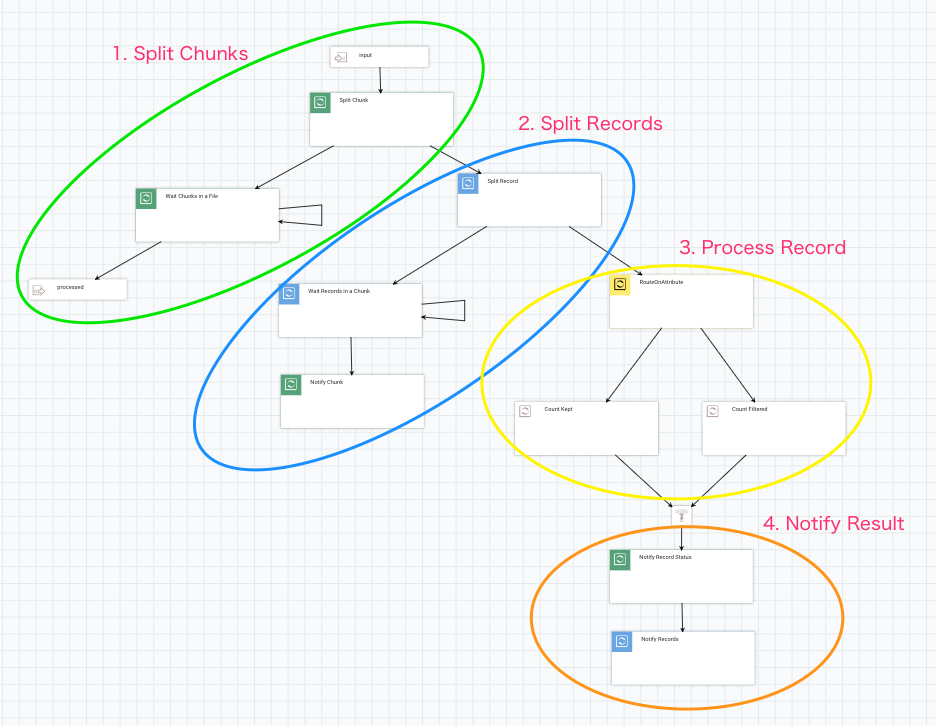
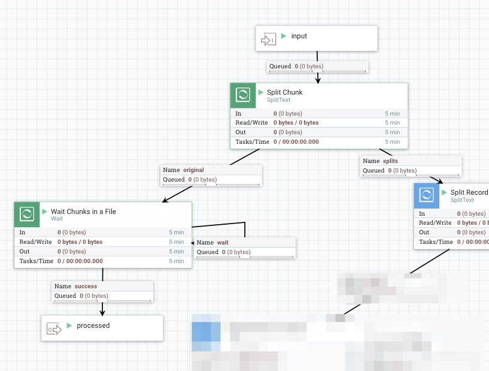
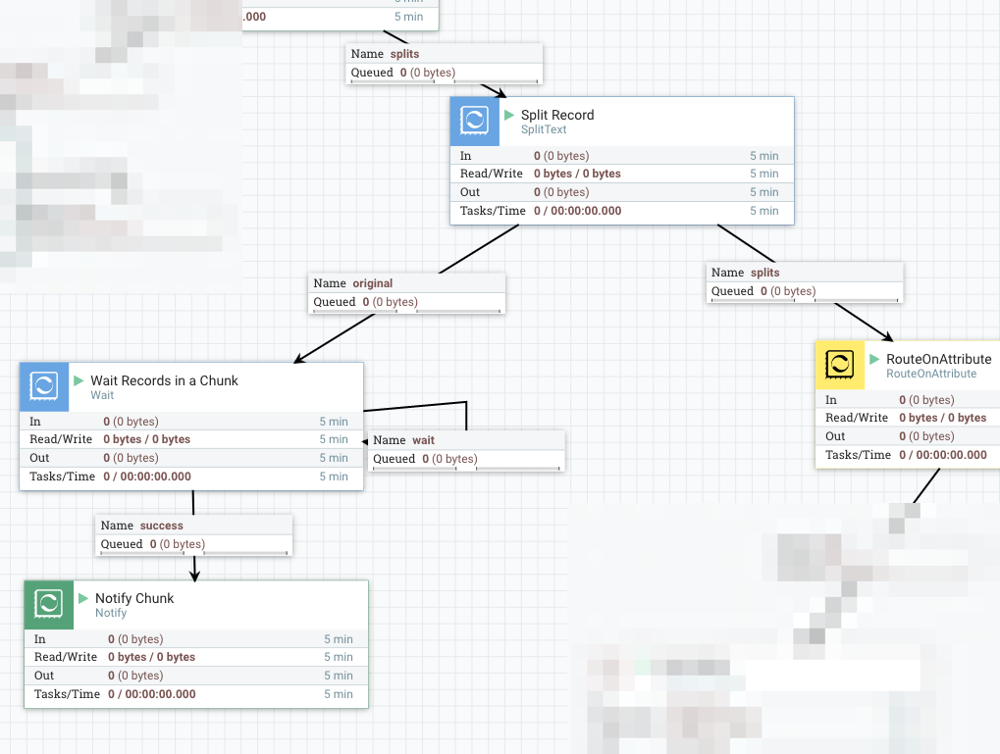
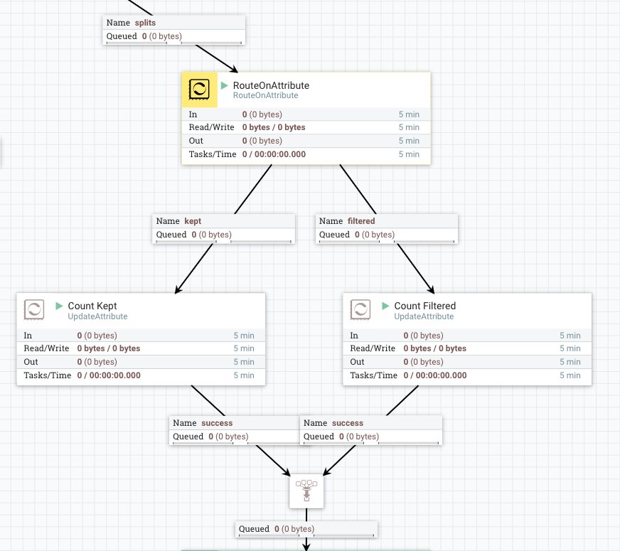
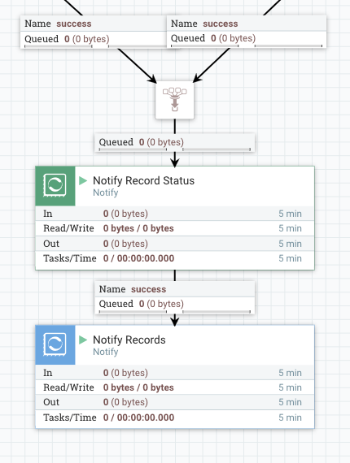

# How to wait for all fragments to be processed, then do something?

I knew that MergeContent has ‘Defragment’ Merge Strategy, and with that, we can merge fragments those are split by Split processors (e.g. SplitText) back to a single flow file. However, sometimes things can be more complicated than that. This post describes the recent improvement that I worked on, to wait for all fragments to be processed.

1. [Why MergeContent don’t suffice](http://ijokarumawak.github.io/nifi/2017/02/02/nifi-notify-batch/#why-mergecontent-dont-suffice)
2. [Alternative Solution, Wait/Notify](http://ijokarumawak.github.io/nifi/2017/02/02/nifi-notify-batch/#alternative-solution-waitnotify)
3. [1. Split a file into Chunks](http://ijokarumawak.github.io/nifi/2017/02/02/nifi-notify-batch/#1-split-a-file-into-chunks)
4. [2. Split a Chunk into Records](http://ijokarumawak.github.io/nifi/2017/02/02/nifi-notify-batch/#2-split-a-chunk-into-records)
5. [3. Process Record](http://ijokarumawak.github.io/nifi/2017/02/02/nifi-notify-batch/#3-process-record)
6. [4. Notify Record processing result](http://ijokarumawak.github.io/nifi/2017/02/02/nifi-notify-batch/#4-notify-record-processing-result)
7. [How fast is it?](http://ijokarumawak.github.io/nifi/2017/02/02/nifi-notify-batch/#how-fast-is-it)
8. [Summary](http://ijokarumawak.github.io/nifi/2017/02/02/nifi-notify-batch/#summary)

## Why MergeContent don’t suffice

It’s very common flow to design with NiFi, that uses Split processor to split a flow file into fragments, then do some processing such as filtering, schema conversion or data enrichment, and after these data processing, you may want to merge those fragments back into a single flow file, then put it to somewhere.

MergeContent can be used for that purpose, but sometimes it won’t be able to merge or wait, in following situations:

- The number of fragments differ from the original. This happens if some of the fragments have been filtered out.
- The number of fragments need to be merged can’t fit in a incoming queue. This happens if there’re more flow files than configured back pressure object threshold for that queue. In this case, some fragments can’t be enqueued, thus MergeContent can’t merge and remove queued flow files, so required fragments can’t be enqueued, a kind of dead-lock situation.
- Using MergeContent ‘Correlation Attribute Name’ might work, but it’s possible to produce multiple result flow files, and you won’t be able to know which one is the last
- The best practice for Split processors is to use two phase splitting. First, split a file into mid-sized chunks, then split a chunk into individual record. This way, we can prevent NiFi to produce a lerge amount of flow file which can cause OutOfMemory error. Also, this makes it difficult to merge it back again, as the second Split overwrites flow file attributes such as ‘fragment.identifier’ and ‘fragment.count’. We can copy those to avoid being overwritten, but flow looks messy if we actually do that.

## Alternative Solution, Wait/Notify

We need something that overcome issues described above, and Wait/Notify processors can be the one.

I designed NiFi flow as follows. There are 4 areas in this flow and it looks like a traditional nested for loop using i and j:

Let’s look at each area closer.

### 1. Split a file into Chunks

I split into 5,000 lines chunks here. Then connect the `original` relationship into a Wait processor. Here is a list of important Wait processor configurations:

- Release Signal Identifier = `${filename}`: it needs to wait for all chunks to be processed, so filename would be legitimate for a signal id.
- Target Signal Count = `${fragment.count}`: The attribute is set by SplitText processor.
- Signal Counter Name = `chunks`: I wanted to count how many records are actually processed, or filtered out. So I used specific counter name here so that those don’t mix.

When Wait processor finds chunks counter reached to fragment.count, the original flow file is passed to the `processed` output port.

### 2. Split a Chunk into Records

Each chunk is passed into another SplitText here, then it produces flow file per individual record. Similar to the previous part, connect `original` to a `Wait`processor, which is configured as follows:

- Release Signal Identifier = `${fragment.identifier}`: When SplitText splits a flow file into fragments, it publishes UUID and assign it to fragment.identifier attribute, outgoing flow files those are derived from the same original input flow file will have the same fragment.identifier. In this example, it is assigned per Chunk.
- Target Signal Count = `${fragment.count}`

When Wait finds all Records in a Chunk has notified, it passes the flow file to `Notify` which notifies to the corresponding Wait processor in the previous part.

- Release Signal Identifier = `${filename}`: same as the corresponding Wait processor.
- Signal Counter Name = `chunks`
- Signal Counter Delta = `1`

### 3. Process Record

In this area, you can do whatever record level processing, such as filter, convert, enrich or call APIs … etc. To make it as simple as possible, I just route records into two groups, `kept` and `filtered`, by RouteOnAttribute:

- Add a dynamic property `filtered` with value as `${fragment.index:mod(2):equals(1)}`: this routes the half of data to filtered relationship

The next processor in both routes is UpdateAttribute, which adds `counter.name`attribute with `kept` or `filtered` as its value.

### 4. Notify Record processing result

At the last part, I used two Notify processors.

The first (green) one is used for adding Record process result counter into the signal that the root `Wait` processor is waiting for, so that downstream processing can use those counts.

- Release Signal Identifier = `${filename}`
- Signal Counter Name = `records.${counter.name}`: use an attribute which is set by the previous part. NOTE: this counter is not conductive for the Wait processor to wait, rather just an additional indicator showing how processing went.
- Signal Counter Delta = `1`
- Signal Buffer Count = `20000`: This is critical for performance, as this processor receives record level flow files. Updating underlying cache engine each time wouldn’t provide good performance. So let’s buffer a lot.

The final `Notify` processor notifies that records are processed, and configured like below:

- Release Signal Identifier = `${fragmnet.identifier}`: Meant to notify the Wait processor which waits for Chunks.
- Signal Counter Name = `${counter.name}`
- Signal Counter Delta = `1`
- Signal Buffer Count = `20000`

If everything is set up correctly, when files are passed to the input port, it will be split into chunks first, then records, and all records and chunks are processed, the original input file is routed to the output port. As another benefit of this approach, the outgoing flow file has following attributes added (result of a file with 1M lines):

- wait.start.timestamp = 1486023148194
- wait.counter.chunks = 200
- wait.counter.records.kept = 500000
- wait.counter.records.filtered 500000

## How fast is it?

It works as expected in terms of functionality, but how about performance? Obviously it can’t be faster than a flow only does Split -> Split -> RouteOnAttribute. But I’d like to see it works as close as the simple flow does. So, conducted following test.

- Single, standalone NiFi, 1.2.0-SNAPSHOT
- Input file: a text file, uncompressed, containing 1,000,000 lines, 955MB in file size
- Each line has 1,000 characters
- nifi.provenance.repository.implementation=org.apache.nifi.provenance.VolatileProvenanceRepository

Without Wait/Notify processors, the flow finished about 1 minute. That is about 16666 events/sec, 15.91 MB/sec. With Wait/Notify processors, it took about 2 minutes, 8333 events/sec, 7.95 MB/sec.

It’s about two times slower than a flow that only splits and processes.

## Summary

Of course it taks longer to complete, waiting asynchronous operations tends to be like that. However, by sacrificing performance a bit, you can design a NiFi flow that tracks record level processing result status, and keep processing order more strictly.

If your use case doesn’t require to wait for something, then just move forward, that’d be the best. But if you do, this approach using Wait/Notify would be helpful.

NOTE: this post contains improvements that is not merged into NiFi master yet, but available as a PR for [NIFI-3431: Support batch update in Notify processor](https://issues.apache.org/jira/browse/NIFI-3431).

Template file is available on [Gist](https://gist.github.com/ijokarumawak/141c1ae248f051cc49e8a08ef891f54c).

个人理解：

| Proccessor            | Property                | Value                            | Comment                                               |
| --------------------- | ----------------------- | -------------------------------- | ----------------------------------------------------- |
| Wait Chunks in a File | ReleaseSignalIdentifier | ${filename}                      | 从Flow File获取需要等待的信号ID，等待目标             |
| Wait Chunks in a File | TargetSignalCount       | ${fragment.count}                | 从FlowFile获取等待条件                                |
| Wait Chunks in a File | SignalCounterName       | chunks                           | 从服务器获取实际值，用来匹配TargetSignalCount匹配目标 |
| Wait Chunks in a File | WaitBufferCount         | 1                                |                                                       |
| Wait Chunks in a File | ReleasableFlowFileCount | 1                                |                                                       |
| Wait Chunks in a File | ExpirationDuration      | 10min                            |                                                       |
| Wait Chunks in a File | DistributedCacheService | DistributedMapCacheClientService |                                                       |
| Wait Chunks in a File | AttributeCopyMode       | Keeporiginal                     |                                                       |
| Wait Chunks in a File | WaitMode                | Transfertowaitrelationship       |                                                       |

| Proccessor              | Property                | Value                            | Comment                                                      |
| ----------------------- | ----------------------- | -------------------------------- | ------------------------------------------------------------ |
| Wait Records in a Chunk | ReleaseSignalIdentifier | ${fragment.identifier}           | 从Flow File获取需要等待的信号ID，等待目标                    |
| Wait Records in a Chunk | TargetSignalCount       | ${fragment.count}                | 从FlowFile获取等待条件                                       |
| Wait Records in a Chunk | SignalCounterName       | Novalueset                       | 从服务器获取实际值，此处如果不设置，则取sid中的id作为key去服务区去value |
| Wait Records in a Chunk | WaitBufferCount         | 1                                |                                                              |
| Wait Records in a Chunk | ReleasableFlowFileCount | 1                                |                                                              |
| Wait Records in a Chunk | ExpirationDuration      | 10min                            |                                                              |
| Wait Records in a Chunk | DistributedCacheService | DistributedMapCacheClientService |                                                              |
| Wait Records in a Chunk | AttributeCopyMode       | Keeporiginal                     |                                                              |
| Wait Records in a Chunk | WaitMode                | Transfertowaitrelationship       |                                                              |

| Proccessor     | Property                | Value                            | Comment                                   |
| -------------- | ----------------------- | -------------------------------- | ----------------------------------------- |
| Notify Records | ReleaseSignalIdentifier | ${fragment.identifier}           | 向服务器注册一个释放信号`ReleaseSignalID` |
| Notify Records | SignalCounterName       | ${counter.name}                  | 从FlowFile赋值                            |
| Notify Records | SignalCounterDelta      | 1                                |                                           |
| Notify Records | SignalBufferCount       | 20000                            |                                           |
| Notify Records | DistributedCacheService | DistributedMapCacheClientService |                                           |
| Notify Records | AttributeCacheRegex     | Novalueset                       |                                           |

| Proccessor   | Property                | Value                            | Comment |
| ------------ | ----------------------- | -------------------------------- | ------- |
| Notify Chunk | ReleaseSignalIdentifier | ${filename}                      |         |
| Notify Chunk | SignalCounterName       | chunks                           |         |
| Notify Chunk | SignalCounterDelta      | 1                                |         |
| Notify Chunk | SignalBufferCount       | 1000                             |         |
| Notify Chunk | DistributedCacheService | DistributedMapCacheClientService |         |
| Notify Chunk | AttributeCacheRegex     | Novalueset                       |         |

| Proccessor           | Property                | Value                            | Comment |
| -------------------- | ----------------------- | -------------------------------- | ------- |
| Notify Record Status | ReleaseSignalIdentifier | ${filename}                      |         |
| Notify Record Status | SignalCounterName       | records.${counter.name}          |         |
| Notify Record Status | SignalCounterDelta      | 1                                |         |
| Notify Record Status | SignalBufferCount       | 20000                            |         |
| Notify Record Status | DistributedCacheService | DistributedMapCacheClientService |         |
| Notify Record Status | AttributeCacheRegex     | Novalueset                       |         |