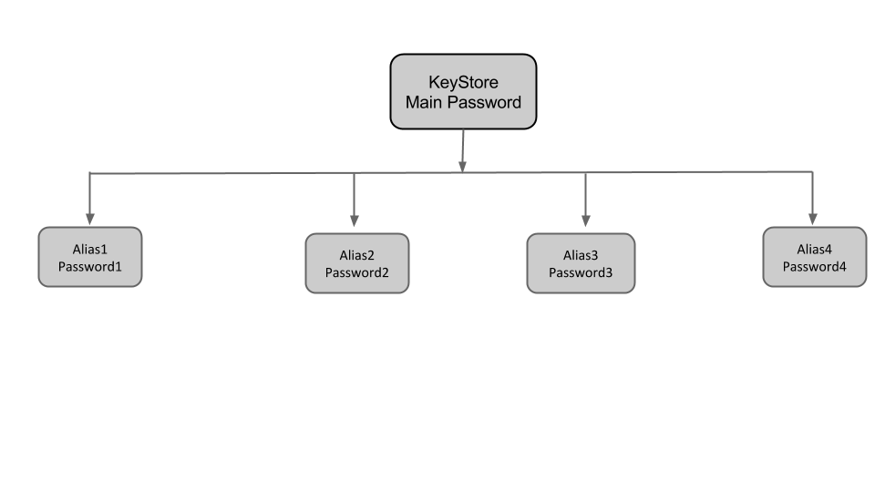

### [What's the difference between Key store password and Key password](https://stackoverflow.com/questions/32304046/whats-the-difference-between-key-store-password-and-key-password-in-android-sig)

**Keystore** is a binary file that contains a set of private keys.

**Private key** represents the entity to be identified with the app, such as a person or a company.

So Keystore password is used to open a keystore and simple password is password of private entity stored in keystore file..!! 

