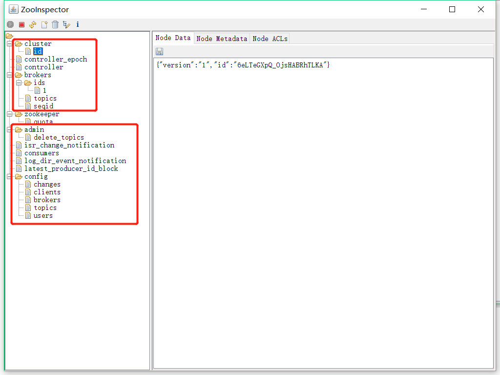
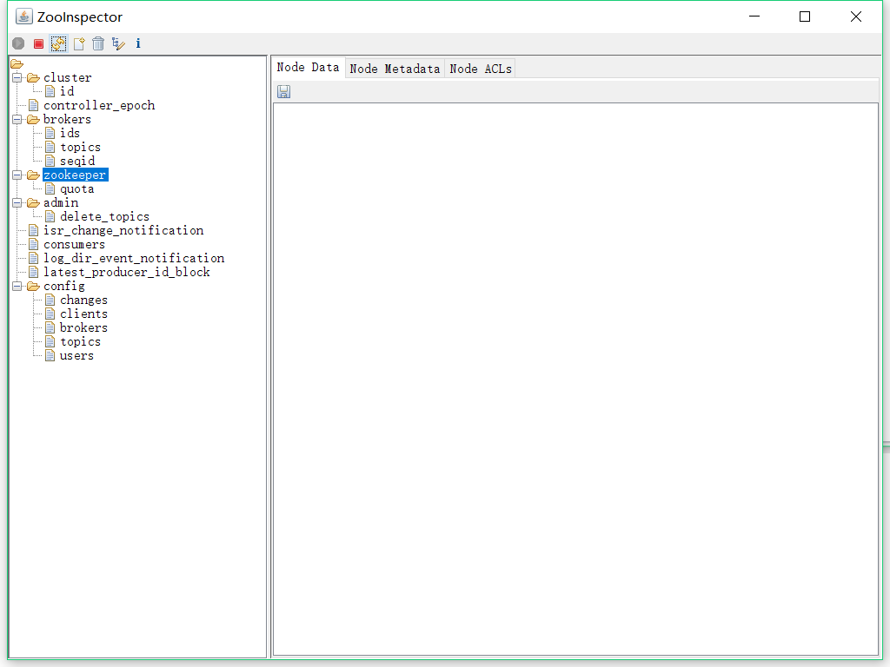
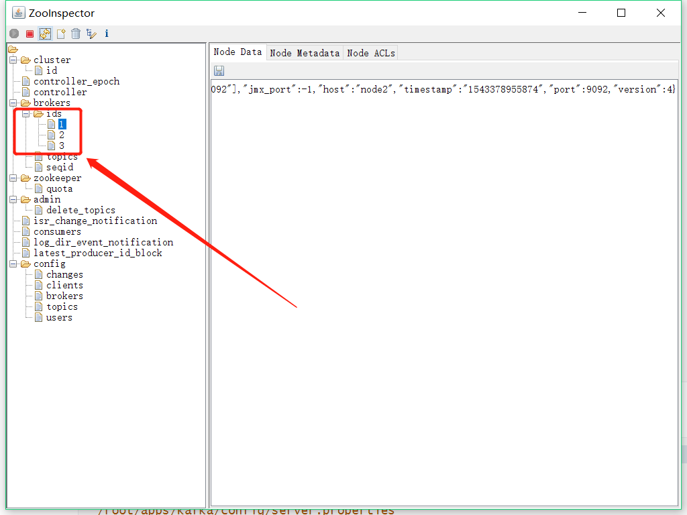

# Kafka集群安装

## 1.下载上传

```shell
[root@node1 ~]# ls
apps  jdk-8u141-linux-x64.tar.gz  kafka_2.11-2.1.0.tgz  zkdata  zookeeper-3.4.9.tar.gz  zookeeper.out
[root@node1 ~]# 
```

## 2.解压安装

```sh
root@node1 ~]# tar -zxvf kafka_2.11-2.1.0.tgz -C apps/
```

## 3.制作短链接

```shell
[root@node1 ~]# cd apps
[root@node1 apps]# ln -s kafka_2.11-2.1.0/ kafka
[root@node1 apps]# ls
jdk  jdk1.8.0_141  kafka  kafka_2.11-2.1.0  zookeeper  zookeeper-3.4.9
[root@node1 apps]# 
```

## 4.配置调整：

```shell
[root@node1 apps]# vi ./kafka/config/
connect-console-sink.properties    connect-file-sink.properties       connect-standalone.properties      producer.properties                trogdor.conf                       
connect-console-source.properties  connect-file-source.properties     consumer.properties                server.properties                  zookeeper.properties               
connect-distributed.properties     connect-log4j.properties           log4j.properties                   tools-log4j.properties             
[root@node1 apps]# vi ./kafka/config/server.properties 

```

```properties
# Licensed to the Apache Software Foundation (ASF) under one or more
# contributor license agreements.  See the NOTICE file distributed with
# this work for additional information regarding copyright ownership.
# The ASF licenses this file to You under the Apache License, Version 2.0
# (the "License"); you may not use this file except in compliance with
# the License.  You may obtain a copy of the License at
#
#    http://www.apache.org/licenses/LICENSE-2.0
#
# Unless required by applicable law or agreed to in writing, software
# distributed under the License is distributed on an "AS IS" BASIS,
# WITHOUT WARRANTIES OR CONDITIONS OF ANY KIND, either express or implied.
# See the License for the specific language governing permissions and
# limitations under the License.

# see kafka.server.KafkaConfig for additional details and defaults

############################# Server Basics #############################

# The id of the broker. This must be set to a unique integer for each broker.
broker.id=0

############################# Socket Server Settings #############################

# The address the socket server listens on. It will get the value returned from
# java.net.InetAddress.getCanonicalHostName() if not configured.
#   FORMAT:
#     listeners = listener_name://host_name:port
#   EXAMPLE:
#     listeners = PLAINTEXT://your.host.name:9092
#listeners=PLAINTEXT://:9092

# Hostname and port the broker will advertise to producers and consumers. If not set,
# it uses the value for "listeners" if configured.  Otherwise, it will use the value
# returned from java.net.InetAddress.getCanonicalHostName().
#advertised.listeners=PLAINTEXT://your.host.name:9092

# Maps listener names to security protocols, the default is for them to be the same. See the config documentation for more details
#listener.security.protocol.map=PLAINTEXT:PLAINTEXT,SSL:SSL,SASL_PLAINTEXT:SASL_PLAINTEXT,SASL_SSL:SASL_SSL

# The number of threads that the server uses for receiving requests from the network and sending responses to the network
num.network.threads=3

# The number of threads that the server uses for processing requests, which may include disk I/O
num.io.threads=8

# The send buffer (SO_SNDBUF) used by the socket server
socket.send.buffer.bytes=102400

# The receive buffer (SO_RCVBUF) used by the socket server
socket.receive.buffer.bytes=102400

# The maximum size of a request that the socket server will accept (protection against OOM)
socket.request.max.bytes=104857600

```

调整为：

```properties
#原始已有
num.network.threads=3
num.io.threads=8
socket.send.buffer.bytes=102400
socket.receive.buffer.bytes=102400
socket.request.max.bytes=104857600
num.partitions=1
num.recovery.threads.per.data.dir=1
offsets.topic.replication.factor=1
transaction.state.log.replication.factor=1
transaction.state.log.min.isr=1
log.retention.hours=168
log.segment.bytes=1073741824
log.retention.check.interval.ms=300000
zookeeper.connection.timeout.ms=6000
group.initial.rebalance.delay.ms=0
#新增更新
broker.id=1
delete.topic.enable=true
log.dirs=/root/kafka_data
zookeeper.connect=node1:2181,node2:2181,node3:2181
```

分发到其他node，并修改`broker.id`属性

## 5.启动Kafka

### 5.1.直接启动

```shell
[root@node2 kafka]# bin/kafka-server-start.sh config/server.properties
```

此时会看到启动日志

```shell
	......
[2018-11-28 12:15:12,682] INFO Kafka version : 2.1.0 (org.apache.kafka.common.utils.AppInfoParser)
[2018-11-28 12:15:12,682] INFO Kafka commitId : 809be928f1ae004e (org.apache.kafka.common.utils.AppInfoParser)
[2018-11-28 12:15:12,697] INFO [KafkaServer id=1] started (kafka.server.KafkaServer)
```

可以查看ZK数据,出现多个新增节点及节点数据：



关闭后zk会自动删除部分节点及数据：



### 5.2守护程序启动

```shell
[root@node2 kafka]# bin/kafka-server-start.sh -daemon config/server.properties
```


查看kafka是否运行：

```shell
[root@node2 kafka]# ps -ef|grep kafka
root       3136      1  3 12:22 pts/0    00:00:05 /root/apps/jdk/bin/java -Xmx1G -Xms1G -server -XX:+UseG1GC -XX:MaxGCPauseMillis=20 -XX:InitiatingHeapOccupancyPercent=35 -XX:+ExplicitGCInvokesConcurrent -Djava.awt.headless=true -Xloggc:/root/apps/kafka/bin/../logs/kafkaServer-gc.log -verbose:gc -XX:+PrintGCDetails -XX:+PrintGCDateStamps -XX:+PrintGCTimeStamps -XX:+UseGCLogFileRotation -XX:NumberOfGCLogFiles=10 -XX:GCLogFileSize=100M -Dcom.sun.management.jmxremote -Dcom.sun.management.jmxremote.authenticate=false -Dcom.sun.management.jmxremote.ssl=false -Dkafka.logs.dir=/root/apps/kafka/bin/../logs -Dlog4j.configuration=file:bin/../config/log4j.properties -cp /root/apps/kafka/bin/../libs/activation-1.1.1.jar:/root/apps/kafka/bin/../libs/aopalliance-repackaged-2.5.0-b42.jar:/root/apps/kafka/bin/../libs/argparse4j-0.7.0.jar:/root/apps/kafka/bin/../libs/audience-annotations-0.5.0.jar:/root/apps/kafka/bin/../libs/commons-lang3-3.5.jar:/root/apps/kafka/bin/../libs/compileScala.mapping:/root/apps/kafka/bin/../libs/compileScala.mapping.asc:/root/apps/kafka/bin/../libs/connect-api-2.1.0.jar:/root/apps/kafka/bin/../libs/connect-basic-auth-extension-2.1.0.jar:/root/apps/kafka/bin/../libs/connect-file-2.1.0.jar:/root/apps/kafka/bin/../libs/connect-json-2.1.0.jar:/root/apps/kafka/bin/../libs/connect-runtime-2.1.0.jar:/root/apps/kafka/bin/../libs/connect-transforms-2.1.0.jar:/root/apps/kafka/bin/../libs/guava-20.0.jar:/root/apps/kafka/bin/../libs/hk2-api-2.5.0-b42.jar:/root/apps/kafka/bin/../libs/hk2-locator-2.5.0-b42.jar:/root/apps/kafka/bin/../libs/hk2-utils-2.5.0-b42.jar:/root/apps/kafka/bin/../libs/jackson-annotations-2.9.7.jar:/root/apps/kafka/bin/../libs/jackson-core-2.9.7.jar:/root/apps/kafka/bin/../libs/jackson-databind-2.9.7.jar:/root/apps/kafka/bin/../libs/jackson-jaxrs-base-2.9.7.jar:/root/apps/kafka/bin/../libs/jackson-jaxrs-json-provider-2.9.7.jar:/root/apps/kafka/bin/../libs/jackson-module-jaxb-annotations-2.9.7.jar:/root/apps/kafka/bin/../libs/javassist-3.22.0-CR2.jar:/root/apps/kafka/bin/../libs/javax.annotation-api-1.2.jar:/root/apps/kafka/bin/../libs/javax.inject-1.jar:/root/apps/kafka/bin/../libs/javax.inject-2.5.0-b42.jar:/root/apps/kafka/bin/../libs/javax.servlet-api-3.1.0.jar:/root/apps/kafka/bin/../libs/javax.ws.rs-api-2.1.1.jar:/root/apps/kafka/bin/../libs/javax.ws.rs-api-2.1.jar:/root/apps/kafka/bin/../libs/jaxb-api-2.3.0.jar:/root/apps/kafka/bin/../libs/jersey-client-2.27.jar:/root/apps/kafka/bin/../libs/jersey-common-2.27.jar:/root/apps/kafka/bin/../libs/jersey-container-servlet-2.27.jar:/root/apps/kafka/bin/../libs/jersey-container-servlet-core-2.27.jar:/root/apps/kafka/bin/../libs/jersey-hk2-2.27.jar:/root/apps/kafka/bin/../libs/jersey-media-jaxb-2.27.jar:/root/apps/kafka/bin/../libs/jersey-server-2.27.jar:/root/apps/kafka/bin/../libs/jetty-client-9.4.12.v20180830.jar:/root/apps/kafka/bin/../libs/jetty-continuation-9.4.12.v20180830.jar:/root/apps/kafka/bin/../libs/jetty-http-9.4.12.v20180830.jar:/root/apps/kafka/bin/../libs/jetty-io-9.4.12.v20180830.jar:/root/apps/kafka/bin/../libs/jetty-security-9.4.12.v20180830.jar:/root/apps/kafka/bin/../libs/jetty-server-9.4.12.v20180830.jar:/root/apps/kafka/bin/../libs/jetty-servlet-9.4.12.v20180830.jar:/root/apps/kafka/bin/../libs/jetty-servlets-9.4.12.v20180830.jar:/root/apps/kafka/bin/../libs/jetty-util-9.4.12.v20180830.jar:/root/apps/kafka/bin/../libs/jopt-simple-5.0.4.jar:/root/apps/kafka/bin/../libs/kafka_2.11-2.1.0.jar:/root/apps/kafka/bin/../libs/kafka_2.11-2.1.0-sources.jar:/root/apps/kafka/bin/../libs/kafka-clients-2.1.0.jar:/root/apps/kafka/bin/../libs/kafka-log4j-appender-2.1.0.jar:/root/apps/kafka/bin/../libs/kafka-streams-2.1.0.jar:/root/apps/kafka/bin/../libs/kafka-streams-examples-2.1.0.jar:/root/apps/kafka/bin/../libs/kafka-streams-scala_2.11-2.1.0.jar:/root/apps/kafka/bin/../libs/kafka-streams-test-utils-2.1.0.jar:/root/apps/kafka/bin/../libs/kafka-tools-2.1.0.jar:/root/apps/kafka/bin/../libs/log4j-1.2.17.jar:/root/apps/kafka/bin/../libs/lz4-java-1.5.0.jar:/root/apps/kafka/bin/../libs/maven-artifact-3.5.4.jar:/root/apps/kafka/bin/../libs/metrics-core-2.2.0.jar:/root/apps/kafka/bin/../libs/osgi-resource-locator-1.0.1.jar:/root/apps/kafka/bin/../libs/plexus-utils-3.1.0.jar:/root/apps/kafka/bin/../libs/reflections-0.9.11.jar:/root/apps/kafka/bin/../libs/rocksdbjni-5.14.2.jar:/root/apps/kafka/bin/../libs/scala-library-2.11.12.jar:/root/apps/kafka/bin/../libs/scala-logging_2.11-3.9.0.jar:/root/apps/kafka/bin/../libs/scala-reflect-2.11.12.jar:/root/apps/kafka/bin/../libs/slf4j-api-1.7.25.jar:/root/apps/kafka/bin/../libs/slf4j-log4j12-1.7.25.jar:/root/apps/kafka/bin/../libs/snappy-java-1.1.7.2.jar:/root/apps/kafka/bin/../libs/validation-api-1.1.0.Final.jar:/root/apps/kafka/bin/../libs/zkclient-0.10.jar:/root/apps/kafka/bin/../libs/zookeeper-3.4.13.jar:/root/apps/kafka/bin/../libs/zstd-jni-1.3.5-4.jar kafka.Kafka config/server.properties
root       3202   1482  0 12:24 pts/0    00:00:00 grep kafka
[root@node2 kafka]# 
```

### 5.3 同样方式启动其他节点

```shell
[root@node3 kafka]# /root/apps/kafka/bin/kafka-server-start.sh -daemon /root/apps/kafka/config/server.properties
[root@node4 kafka]# /root/apps/kafka/bin/kafka-server-start.sh -daemon /root/apps/kafka/config/server.properties
```

集群启动完成之后，可以看到已经有多个节点




## 5.Kafka 简单应用：

```shell
创建topic
/bigdata/kafka_2.11-0.10.2.1/bin/kafka-topics.sh --create --zookeeper node1:2181,node2:2181,node3:2181 --replication-factor 3 --partitions 3 --topic my-topic

列出所有topic
/bigdata/kafka_2.11-0.10.2.1/bin/kafka-topics.sh --list --zookeeper node1:2181,node2:2181,node3:2181

查看某个topic信息
/bigdata/kafka_2.11-0.10.2.1/bin/kafka-topics.sh --describe --zookeeper node1:2181,node2:2181,node3:2181 --topic my-topic

启动一个命令行的生产者
/bigdata/kafka_2.11-0.10.2.1/bin/kafka-console-producer.sh --broker-list node2:9092,node3:9092,,node4:9092 --topic my-topic

启动一个命令行的消费者
/bigdata/kafka_2.11-0.10.2.1/bin/kafka-console-consumer.sh --zookeeper node1:2181,node2:2181,node3:2181 --topic my-topic --from-beginning

消费者连接到borker的地址

/bigdata/kafka_2.11-0.10.2.1/bin/kafka-console-consumer.sh --bootstrap-server node2:9092,node3:9092,node4:9092 --topic my-topic --from-beginning 
```

## 6.Kafka 简单api调用

