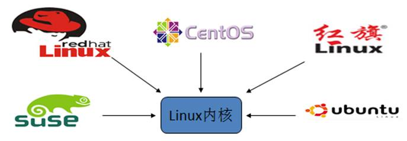
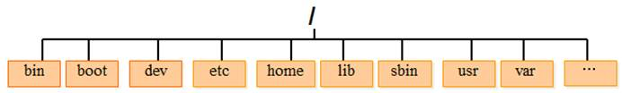
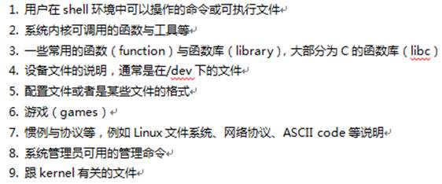
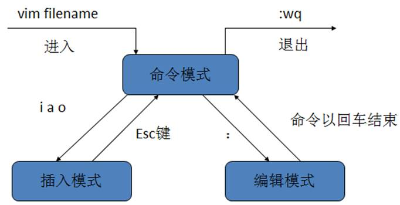
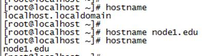
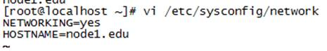
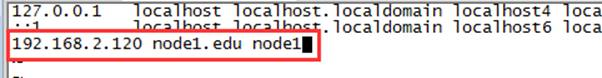

 

# 1      Linux简介 

## UNIX与Linux发展史

Unix在1969年，美国贝尔实验室的肯汤普森在DEC PDP-7机器上开发出了UNIX系统。

Linux出现于1991年，是由芬兰赫尔辛基大学学生李纳斯·托瓦兹（Linus Torvalds）和后来加入的众多爱好者共同开发完成 。

 

 

## Linux介绍 

Linux是一种自由和开放源码的操作系统，存在着许多不同的Linux发行版本，但它们都使用了Linux内核。

Linux内核网站：[www.kernel.org](http://www.kernel.org) 

基于内核，再增加一些桌面，应用程序，就可以发行，称为开发版。

Linux两大阵营：

Redhat系列  redhat，suse，CentOS，Fedora等

Debian系列   debian，ubuntu等

区别： 命令细微的区别； 安装方式

## Linux应用领域

Linux企业服务器  

嵌入式系统：Linux可安装在各种计算机硬件设备中，比如手机、平板电脑、路由器、智能家电等嵌入式系统。

电影娱乐行业：电影后期特效处理。

## Linux特点

开源

多用户，多任务，丰富的网络功能，可靠的系统安全，良好的可移植性，具有标准兼容性，良好的用户界面，出色的速度性能

服务器不使用图形化界面：

图形化占用资源

机房部署方便，无需配置操作界面

## CentOS  社区版

**主流：**目前的Linux操作系统主要应用于生产环境，主流企业级Linux系统仍旧是RedHat或者CentOS

**免费**：RedHat 和CentOS差别不大，CentOS是一个基于Red Hat Linux 提供的可自由使用源代码的企业级Linux发行版本

**更新方便**：CentOS独有的yum命令支持在线升级，可以即时更新系统，不像RedHat 那样需要花钱购买支持服务！

CentOS官网：<http://www.centos.org/>

CentOS搜狐镜像：<http://mirrors.sohu.com/centos/>

CentOS网易镜像：<http://mirrors.163.com/centos/>

# 2      Linux安装

安装环境：Windows7/win10 , VMware Workstation11, CentOS 6.6

## VMware

VMware是一个虚拟PC的软件，可以在现有的操作系统上虚拟出一个新的硬件环境，相当于模拟出一台新的PC ，以此来实现在一台机器上真正同时运行两个独立的操作系统 。

VMware主要特点：

1、不需要分区或重新开机就能在同一台PC上使用两种以上的操作系统

2、本机系统可以与虚拟机系统网络通信

3、可以设定并且随时修改虚拟机操作系统的硬件环境

 

## 学习方法

### 转变思维习惯

图形化界面/鼠标 ===〉 命令/键盘

Linux 与windows 主要区别：

Linux严格区分大小写

Linux中一切皆文件

Linux 不区分扩展名  扩展名是为了让管理员使用

### 不惧英文 勇往直前

记住常用英文，linux都是有套路的

command not found   Permission denied

### 动起来 练习

无他，唯手熟尔   

命令要敲的999，虚拟机环境可以随意折腾

# 3      Linux目录结构

/bin: (binaries) 存放系统命令的目录，所有用户都可以执行。

/sbin : (super user binaries) 保存和系统环境设置相关的命令，只有超级用户可以使用这些命令，有些命令可以允许普通用户查看。

/usr/bin：存放系统命令的目录，所有用户可以执行。这些命令和系统启动无关，单用户模式下不能执行

/usr/sbin：存放根文件系统不必要的系统管理命令，超级用户可执行

/root: 存放root用户的相关文件,root用户的家目录。宿主目录  超级用户

/home：用户缺省宿主目录 eg:/home/spark

/tmp：(temporary)存放临时文件

/etc：(etcetera)系统配置文件

/usr：（unix software resource）系统软件共享资源目录，存放所有命令、库、手册页等

/proc：虚拟文件系统，数据保存在内存中，存放当前进程信息

/boot：系统启动目录

 

/dev：(devices)存放设备文件

/sys :虚拟文件系统，数据保存在内存中，主要保存于内存相关信息

/lib：存放系统程序运行所需的共享库

/lost+found：存放一些系统出错的检查结果。

/var：(variable) 动态数据保存位置，包含经常发生变动的文件，如邮件、日志文件、计划任务等

/mnt：(mount)挂载目录。临时文件系统的安装点，默认挂载光驱和软驱的目录

/media:挂载目录。 挂载媒体设备，如软盘和光盘

/misc:挂载目录。 挂载NFS服务

/opt: 第三方安装的软件保存位置。 习惯放在/usr/local/目录下

/srv : 服务数据目录

# 4      Linux常用命令

**命令格式：**命令  [-选项]  [参数]

如：ls  -la  /usr

**说明：**   

大部分命令遵从该格式

多个选项时，可以一起写   eg:ls –l –a à ls –la

简化选项与完整选项(注：并非所有选项都可使用完整选项)     eg:ls –all  à ls –a

### su 命令

作用：切换用户身份

语法：su [选项] 用户名

\-      表示用户的环境变量一起切换

-c    仅执行一次命令，而不切换用户身份 

$ su – root 

env

$ su – root –c “useradd longjing”

 

## 文件处理命令

文件或目录的CRUD

### cd    

英文：change directory  命令路径：内部命令   执行权限：所有用户

作用： 切换目录

语法：cd [目录]
​       / 切换到根目录     

.. 回到上一级目录    

. 当前目录

\-  显示并打开到上一次操作的目录     

​     ~ 当前用户的宿主目录（eg:# cd ~用户名  进入某个用户的家目录）

### ls   

英文：list     命令路径：/bin/ls      执行权限：所有用户

作用：显示目录文件

语法：ls [-alrRd] [文件或目录]

-a all 显示所有文件，注意隐藏文件，特殊目录.和..    

-l（long） 显示详细信息    

-R（recursive）   递归显示当前目录下所有目录  

-r (reverse)  逆序排序

-t（time）    按修改时间排序（降序）

​     ll  相当于 ls –l

### pwd 

英文：print working directory     命令路径：/bin/pwd        执行权限：所有用户

作用：显示当前工作目录

语法：pwd [-LP]

​       -L 显示链接路径，当前路径，默认

​       -P 物理路径

eg:# cd /etc/init.d

\#pwd [-P]

### mkdir 

英文：make directories   命令路径：/bin/mkdir     执行权限：所有用户

作用：创建新目录

语法：mkdir [-p] 目录名

-p 父目录不存在情况下先生成父目录 （parents）

eg: mkdir linux/test  如果目录linux不存在，则报错，使用参数-p即可自动创建父目录。

### touch

命令路径：/bin/touch            执行权限：所有用户

作用：创建空文件或更新已存在文件的时间      

语法：touch 文件名    

eg:touch  a.txt  b.txt   touch {a.txt，b.txt}    同时创建多个文件

创建带空格的文件   eg:touch "program files"   在查询和删除时也必须带双引号

注意：生产环境中，文件名，一定不要加空格

### cp

英文：copy         命令路径：/bin/cp           执行权限：所有用户

作用：复制文件或目录

语法：cp [–rp]  源文件或目录 目的目录

-r -R recursive 递归处理，复制目录

-p 保留文件属性 （原文件的时间不变）

eg:

1，相对路径  cp –R /etc/* .     cp –R ../aaa  ../../test/

2,，绝对路径  cp –R **/**ect/service  /root/test/aa/bb

### mv 

英文：move       命令路径：/bin/mv          执行权限：所有用户

作用：移动文件或目录、文件或目录改名

语法：mv 源文件或目录 目的目录

### rm

英文：remove    命令路径：/bin/rm          执行权限：所有用户

作用：删除文件

语法： rm [-rf] 文件或目录

-r  （recursive）删除目录，同时删除该目录下的所有文件

-f（force） 强制删除文件或目录 即使原档案属性设为唯读,亦直接删除,无需逐一确认

 

**注意：工作中，谨慎使用rm –rf 命令。**

**扩展点**：删除乱码文件

一些文件乱码后使用rm -rf 依然无法删除

此时，使用ll -i 查找到文件的inode节点

然后使用find . -inum 查找到的inode编号  -exec rm {} -rf \;

就能顺利删除了

### cat  

英文：concatenate  命令路径：/bin/cat          执行权限：所有用户

作用：显示文件内容

语法：cat [-n] [文件名]

​      -A  显示所有内容，包括隐藏的字符   

​       -n   显示行号     

eg：cat /etc/services

### more

命令路径：/bin/more             执行权限：所有用户

作用：分页显示文件内容

语法：more [文件名]

空格或f   显示下一页

Enter键   显示下一行

q或Q  退出

### head  

命令路径：/usr/bin/head              执行权限：所有用户

作用：查看文件前几行（默认10行）

语法：head [文件名]

​       -n 指定行数 

eg：head -20 /etc/services   head –n 3 /etc/services

### tail 

命令路径：/usr/bin/tail   执行权限：所有用户

作用：查看文件的后几行       

语法：tail [文件名] 

-n 指定行数 

-f  （follow） 动态显示文件内容

获取一个大文件的部分文件，可使用head或tail命令

head -n 100 /etc/services >config.log

### ln   

英文： link  命令路径：/bin/ln     执行权限：所有用户

作用：产生链接文件     

语法：

ln -s   [源文件]    [目标文件]    创建软链接       源文件 使用 绝对路径

ln  [源文件]    [目标文件]    创建硬链接

 eg:ln -s /etc/service  ./service.soft

创建文件/etc/service的软链接service.soft

eg:/etc/service  /service.hard 

创建文件/etc/service的硬链接/service.hard    

软连接类似于windows下的快捷方式

软连接文件格式：

lrwxrwxrwx. 1 root root     13 Jul 20 07:50 service -> /etc/services

1     硬链接数量，如果该文件没有硬链接，就只有本身一个硬链接。

13链接文件的长度

**格式解析（特征）：**

   1， 软连接的文件类型是 l（软连接），软连接文件的权限 都是  lrwxrwxrwx 

   2，->  箭头指向到源文件

真正的权限取决于对源文件的权限

时间值为创建软连接的时间

软连接可以跨文件系统生成

硬链接特征

1，相当于 cp -p +同步更新  

2，通过i节点识别，与源文件有相同的inode节点

3，硬链接不能跨分区，ln /home/test/issuels /boot/test （错误）  

4，不能针对目录使用  ln /tmp/ aa.hard   （无法将目录/tmp 生成硬链接）

删除软连接

**rm -rf symbolic_name** 

 

## 帮助命令

### man

英文：manual    命令路径：/usr/bin/man        执行权限：所有用户

作用：获取命令或配置文件的帮助信息

语法：man [命令/配置文件]

eg：man ls    man  services   

（查看配置文件时，不需要配置文件的绝对路径，只需要文件名即可）

调用的是more命令来浏览帮助文档，按空格翻下一页，按回车翻下一行，按q退出。

使用/加上关键的参数可直接定位搜索，  n  查找下一个，shift+n  查找上一个

eg: /-l   直接查看-l的介绍  

 

**扩展：man的级别** （帮助文档的类型, 了解1 5即可）

man man-pages 查看每一种类型代表的含义   man文档的类型(1~9)

1是命令，5是配置文件  man优先显示命令，可指定帮助类型

eg:man 5 passwd (5代表配置文件级别)

### help

help  查看shell内置命令的帮助信息

eg:help cd

内置命令，使用whereis,which,man都不能查看

type 命令 查看内部命令还是外部命令

 

### 命令名 --help

命令名 --help 列举该命令的常用选项

 eg: cp --help

## 文件搜索命令

### find      

命令路径：/bin/find        执行权限：所有用户

作用：查找文件或目录      

语法：find [搜索路径] [匹配条件]

**如果没有指定搜索路径，默认从当前目录查找**

find命令选项

**-name** **按名称查找  精准查找**

eg:find  /etc  -name  “init” 在目录/etc中查找文件init

**-iname** **按名称查找**

find查找中的字符匹配：

*：匹配所有

？：匹配单个字符

eg:find  /etc  -name  “init???”    在目录/etc中查找以init开头的，且后面有三位的文件

模糊匹配的条件，建议使用单引号或双引号括起来。如果*被转义，可使用 单双引号括住查询条件，或者使用\*。

eg: # find . –name *g

**-size**  **按文件大小查找**

以block为单位，一个block是512B, 1K=2block    +大于  -小于  不写是等于 

eg:find /etc -size -204800  在etc目录下找出大于100MB的文件

 100MB=102400KB=204800block 

**-type**  **按文件类型查找** 

 f 二进制文件  l 软连接文件 d 目录  c 字符文件 

eg: find /dev -type c

 

**find****查找的基本原则**：

占用最少的系统资源，即查询范围最小，查询条件最精准

eg：

如果明确知道查找的文件在哪一个目录，就直接对指定目录查找，不查找根目录/ 

 

 

### grep命令 

命令路径：/bin/grep              执行权限：所有用户

作用：在文件中搜寻字串匹配的行并输出      

 语法：grep [-cinv] '搜寻字符串' filename

 选项与参数：

   -c ：输出匹配行的次数（是以行为单位，不是以出现次数为单位）

   -i ：忽略大小写，所以大小写视为相同

   -n ：显示匹配行及行号

   -v ：反向选择，显示不包含匹配文本的所有行。

eg：grep ftp  /etc/services 

eg:#grep -v ^# /etc/inittab         去掉文件行首的#号

eg:# grep -n “init”/etc/inittab  显示在inittab文件中，init匹配行及行号

eg:# grep -c“init”/etc/inittab   显示在inittab文件中，init匹配了多少次

### which    

命令路径：/usr/bin/which            执行权限：所有用户

作用：**显示系统命令所在目录（绝对路径及别名）**  

which命令的作用是，在PATH变量指定的路径中，搜索某个系统命令的位置，并且返回第一个搜索结果。也就是说，使用which命令，就可以看到某个系统命令是否存在，以及执行的到底是哪一个位置的命令

\# which ls

alias ls='ls --color=auto'

​         /bin/ls

\# which zs

/usr/bin/which: no zs in (/usr/local/bin:/usr/bin:/bin:/usr/local/sbin:/usr/sbin:/sbin:/home/ch/bin)

### whereis

命令路径：/usr/bin/whereis         执行权限：所有用户

作用：**搜索命令所在目录 配置文件所在目录  及帮助文档路径**      

eg: which passwd    和   whereis  passwd   

eg:查看/etc/passwd配置文件的帮助，就用  man 5 passwd

 

## 压缩解压缩命令

### gzip 

英文：GNU zip  命令路径：/bin/gzip        执行权限：所有用户

作用：压缩(解压)文件,压缩文件后缀为.gz    

gzip只能压缩文件，不能压缩目录；不保留原文件

语法：gzip 文件

-d将压缩文件解压（decompress）

 

解压使用gzip –d或者 gunzip

### bzip2  

命令路径：/usr/bin/bzip2             执行权限：所有用户

作用：**压缩(解压)文件,压缩文件后缀为.bz2**

语法：bzip2 [-k] [文件]   

-k:产生压缩文件后保留原文件（压缩比高）

-d 解压缩的参数（decompress）

解压使用bzip2 –d或者 bunzip2

### zip   

命令路径：/usr/bin/zip          执行权限：所有用户

作用：**压缩(解压)文件,压缩文件后缀为.zip**

语法：zip 选项[-r]  [压缩后文件名称] [文件或目录]   

 -r压缩目录

eg：zip services.zip /etc/services  压缩文件; 

zip -r test.zip  /test  压缩目录

如果不加-r选项，压缩后的文件没有数据。

解压使用unzip 

### tar 

命令路径：/bin/tar          执行权限：所有用户

作用：文件、目录打（解）包

语法：tar [-zcf] 压缩后文件名  文件或目录

-c 建立一个压缩文件的参数指令（create），后缀是.tar

-x 解开一个压缩文件的参数指令（extract）

​       -z 以gzip命令压缩/解压缩  

-j  以bzip2命令压缩/解压缩 

-v 压缩的过程中显示文件（verbose）

-f file 指定文件名,必选项

 

1， 单独的打包 ，解包   tar –cf   tar –xf 

2， 打包之后，进行压缩  gzip   bzip2

3， 一步到位  tar –zcvf       tar -zxvf

tar -cf   -xf     单独 压缩  解压缩

tar  -z 以gzip打包目录并压缩  文件格式.tar.gz（.tgz）

tar  -j 以bzip2打包目录并压缩  文件格式.tar.bz2

 eg:tar -zcvf dir1.tar.gz  dir1   使用gzip将目录dir1压缩成一个打包并压缩文件dir1.tar.gz

​     tar -zxvf  dir1.tar.gz -C(大写的)  /root     解压到指定的/root目录

 eg: tar -cvf bak.tar  .    将当前目录的文件打包为bak.tar

 eg: tar -xvf bak.tar   解压

 eg: tar -zcvf bak.tar.gz  bak.tar   或 gzip  bak.tar    使用gzip将打包文件bak.tar压缩为bak.tar.gz

 eg: tar -jcvf bak.tar.bz2  bak.tar  或 bzip2 bak.tar   使用bzip2将打包文件bak.tar压缩为bak.tar.bz2

 eg: tar -rvf bak.tar /etc/password     将/etc/password追加文件到bak.tar中(r)

 eg：tar -cjvf test.tar.bz2  test  生成test.tar.bz2的压缩文件

 eg：tar -xjf test.tar.bz2        解压

最常用：   tar + gzip

tar –zcvf 压缩    

tar –zxvf  解压

补充：

1，文件路径， 压缩包带文件路径

2，源文件是保留的，不会被删除

## 系统关机命令

**shutdown**  [选项] 时间    

选项：  -c: 取消前一个关机命令   

-h:关机   

-r:重启

eg:

shutdown -h  now  立即关机     shutdown  -h  20:30   定时关机

其他关机命令   halt     poweroff     init 0

其他重启命令  

**reboot**  重启系统    reboot -h now    立即重启

init 6

注意：生产环境中，关机命令和重启命令谨慎执行。

# 5 Linux学习技巧

善于查看man help等帮助文档 

利用好Tab键  自动补全

掌握好一些快捷键

ctrl + c（停止当前进程）

ctrl + z  挂起当前进程，放后台

ctrl + r（查看命令历史） history

ctrl + l（清屏，与clear命令作用相同）

方向箭头  上 下 可以查看执行过的命令

ctrl + a  行首 ctrl + e 行尾

ctrl + k  清除   ctrl+ w 清除单词

# 6 VIM文本编辑器

vim/vi是Unix / Linux上最常用的文本编辑器而且功能非常强大。

只有命令，没有菜单。

 

《大碗》编辑器版

周围的同事不是用VI就是Emacs，你要是用UltraEdit都不好意思跟人家打招呼...什么插件呀、语法高亮呀、拼写检查呀，能给它开的都给它开着，就是一个字：酷！你说这么牛X的一东西，怎么着学会也得小半年吧。半年！？入门都远着呢！能学会移动光标就不错了，你还别说耗不起，就这还是左右移动！！！

:

## VIM工作模式

命令模式：又称一般模式

编辑模式：又称底行模式，命令行模式

 

## 插入命令

| 命令           | 作用                      |
| -------------- | ------------------------- |
| a              | 在光标后附加文本          |
| A（shift + a） | 在本行行末附加文本   行尾 |
| i              | 在光标前插入文本          |
| I(shift+i)     | 在本行开始插入文本 行首   |
| o              | 在光标下插入新行          |
| O(shift+o)     | 在光标上插入新行          |

## 定位命令

| 命令      | 作用                  |
| --------- | --------------------- |
| :set nu   | 设置行号              |
| :set nonu | 取消行号              |
| gg   G    | 到第一行   到最后一行 |
| nG        | 到第n行               |
| :n        | 到第n行               |

## 保存和退出命令

| 命令            | 作用                                             |
| --------------- | ------------------------------------------------ |
| :w              | 保存修改                                         |
| :w new_filename | 另存为指定文件                                   |
| :w >> a.txt     | 内容追加到a.txt文件中 文件需存在                 |
| :wq             | 保存修改并退出                                   |
| shift+zz（ZZ）  | 快捷键，保存修改并退出                           |
| :q!             | 不保存修改退出                                   |
| :wq!            | 保存修改并退出（文件所有者可忽略文件的只读属性） |

 

不保存并退出：

1， 有修改，但是修改后的内容是不保存的

2， 有突发情况，导致窗口退出。修改文件之后，直接删除同名的.swp文件

## 删除命令

| 命令    | 作用                                            |
| ------- | ----------------------------------------------- |
| x       | 删除光标所在处字符   nx 删除光标所在处后n个字符 |
| dd      | 删除光标所在行，ndd删除n行                      |
| :n1,n2d | 删除指定范围的行（eg :1,3d   删除了123这三行）  |
| dG      | 删除光标所在行到末尾的内容                      |
| D       | 删除从光标所在处到行尾                          |

## 复制和剪切命令

| 命令    | 作用                           |
| ------- | ------------------------------ |
| yy、Y   | 复制当前行                     |
| nyy、nY | 复制当前行以下n行              |
| dd      | 剪切当前行                     |
| ndd     | 剪切当前行以下n行              |
| p、P    | 粘贴在当前光标所在行下  或行上 |

## 替换和取消命令

| 命令         | 作用                                |
| ------------ | ----------------------------------- |
| r            | 取代光标所在处字符                  |
| R(shift + r) | 从光标所在处开始替换字符，按Esc结束 |
| u            | undo,取消上一步操作                 |
| ctrl+r       | redo,返回到undo之前                 |

## 搜索和替换命令

| 命令              | 作用                                          |
| ----------------- | --------------------------------------------- |
| /string           | 向后搜索指定字符串   搜索时忽略大小写 :set ic |
| ?string           | 向前搜索指定字符串                            |
| n                 | 搜索字符串的下一个出现位置,与搜索顺序相同     |
| N（Shift + n）    | 搜索字符串的上一个出现位置,与搜索顺序相反     |
| :%s/old/new/g     | 全文替换指定字符串                            |
| :n1,n2s/old/new/g | 在一定范围内替换指定字符串                    |

% 指全文，s 指开始，g 指全局替换

​    起始行，终止行s/要替换的字符串/替换的新的字符串/g    c 询问确认

​    eg: :%s/ftp/yang/g    全局替换，把ftp替换为yang

​    eg: :41,44/yang/lee/c   从41行到44行，把yang替换为lee,询问是否替换

​    eg: :41,44/yang/lee/g   同上，不询问，直接替换

​    eg: :%s/\/root/\/ROOT/g  把/root替换为/ROOT

​    eg: :%s#/bin/bash#/bin/ksh/g        把/bin/bash全部替换为/bin/ksh

**使用替换命令来添加删除注释**

:% s/^/#/g 来在全部内容的行首添加 # 号注释

:1,10 s/^/#/g 在1~10 行首添加 # 号注释

vi里面怎么查命令？？

：！which cp

vi里面怎么导入命令的结果？

：r !which cp

 

## 可视化模式

**v**  可视字符模式

**V****（shift+v）** 可视行模式，选择多行操作

**ctrl+v** 可视块模式（列模式），操作列

I或者O进入插入模式。

# Linux环境配置

## 修改ip地址

1，图形化界面

2，setup 命令虚拟界面

3，修改配置文件（以网络方式为NAT示例）

vi /etc/sysconfig/network-scripts/ifcfg-eth0

BOOTPROTO=static

ONBOOT=yes

IPADDR=192.168.2.129

NETMASK=255.255.255.0

GATEWAY=192.168.2.**2**      #网段2任意，IP地址2固定，网段为vmnet8的设置的IP网段

DNS1=114.114.114.114   

DNS2=8.8.8.8

重启网络生效：

service network restart

 

## 网络通信命令

### ping 

命令路径：/bin/ping       执行权限：所有用户

作用：测试网络的连通性

语法：ping 选项 IP地址 

 -c 指定发送次数    

ping 命令使用的是icmp协议，不占用端口

eg: # ping -c 3 127.0.0.1

### ifconfig 

英文：interface configure 命令路径：/sbin/ifconfig            执行权限：root

作用：查看和设置网卡网络配置

语法：ifconfig [-a] [网卡设备标识]   

-a：显示所有网卡信息

ifconfig [网卡设备标识] IP地址             修改ip地址

### netstat 

英文：network statistics        命令路径：/bin/netstat          执行权限：所有用户

作用：主要用于检测主机的网络配置和状况

-a  all显示所有连接和监听端口

-t (tcp)仅显示tcp相关选项

-u (udp)仅显示udp相关选项

-n 使用数字方式显示地址和端口号

-l （listening）  显示监控中的服务器的socket

eg:# netstat -tlnu      查看本机监听的端口

tcp 0 0 0.0.0.0:111 0.0.0.0:* LISTEN

协议  待收数据包  待发送数据包  本地ip地址：端口 远程IP地址：端口

\#netstat -au 列出所有 udp 端口 

\# nestat -at 列出所有tcp端口

\#netstat -an  查看本机所有的网络连接

netstat –antpl  

## 修改主机名

临时生效：

hostname 主机名   

永久生效：修改配置文件

vi /etc/sysconfig/network

## 修改映射关系

修改主机名和ip地址之间的映射关系

vi /etc/hosts

192.168.2.120 node-1.edu.cn node-1

可配置别名

## 进程管理命令

**进程和程序的区别：**

1、程序是静态概念，本身作为一种软件资源长期保存；而进程是程序的执行过程，它是动态概念，有一定的生命期，是动态产生和消亡的。

2、程序和进程无一一对应关系。一个程序可以由多个进程共用；另一方面，一个进程在活动中有可顺序地执行若干个程序。

**进程和线程的区别：**

进程： 就是正在执行的程序或命令，每一个进程都是一个运行的实体，都有自己的地址空间，并占用一定的系统资源。

线程： 轻量级的进程；进程有独立的地址空间，线程没有；线程不能独立存在，它由进程创建；相对讲，线程耗费的cpu和内存要小于进程。

进程管理的作用？

判断服务器的健康状态

查看系统所有的进程

杀死进程

### ps命令

作用：查看系统中的进程信息

语法：ps [-auxle]

常用选项

​    a：显示所有用户的进程

​    u：显示用户名和启动时间

​    x：显示没有控制终端的进程

​    e：显示所有进程，包括没有控制终端的进程

​    l：长格式显示

**查看系统中所有进程**

\# ps aux     #查看系统中所有进程，使用BSD操作系统格式，unix

\# ps -le        #查看系统中所有进程，使用Linux标准命令格式

ps应用实例
​     \# ps -u or ps -l  查看隶属于自己进程详细信息

\# ps aux | grep sam    查看用户sam执行的进程 
​     \# ps -ef | grep init        查看指定进程信息

 

### pstree

**作用：**查看当前进程树

语法：pstree [选项]

​       -p 显示进程PID

​       -u   显示进程的所属用户

 

### top     

作用：查看系统健康状态  

显示当前系统中耗费资源最多的进程,以及系统的一些负载情况。

语法：top [选项]

​       -d 秒数，指定几秒刷新一次，默认3秒（动态显示）

 

### kill 

作用：关闭进程

语法：kill [-选项] pId

kill -9 进程号（强行关闭）  常用

kill -1 进程号（重启进程）

 

## 用户管理命令

### useradd

添加用户

语法：useradd [选项] 用户名

### passwd

修改密码命令

语法：passwd [选项] [用户名]

用户密码：生产环境中，用户密码长度8位以上，设置大小写加数字加特殊字符，要定期更换密码。

ys^h_L9t

 

### userdel（user delete）

删除用户

-r 删除账号时同时删除宿主目录（remove）

 

## 磁盘空间命令

### df命令

作用：用于查看Linux文件系统的状态信息,显示各个分区的容量、已使用量、未使用量及挂载点等信息。看剩余空间

语法：df [-hkam] [挂载点]

-h（human-readable）根据磁盘空间和使用情况 以易读的方式显示 KB,MB,GB等
 -k 　以KB 为单位显示各分区的信息，默认

-M   以MB为单位显示信息
 -a 　显示所有分区包括大小为0 的分区

### du命令

作用：用于查看文件或目录的大小（磁盘使用空间）

语法：du [-abhs] [文件名目录]

​       -a 显示子文件的大小

​       -h以易读的方式显示 KB,MB,GB等

​       -s summarize 统计总占有量

eg:
 du -a(all) /home 　显示/home 目录下每个子文件的大小,默认单位为kb

du -b /home 　以bytes为单位显示/home 目录下各个子目录的大小

du -h /home 以K，M,G为单位显示/home 文件夹下各个子目录的大小

du -sh /home 　以常用单位（K,M,G）为单位显示/home 目录的总大小 -s summarize

 

df命令和du命令的区别：

df命令是从文件系统考虑的，不仅考虑文件占用的空间，还要统计被命令或者程序占用的空间。

du命令面向文件，只计算文件或目录占用的空间。

\#df –h /

\#du –sh /

 

### free 

作用：查看内存及交换空间使用状态

语法： free [-kmg]

选项：

-k:    以KB为单位显示，默认就是以KB为单位显示

-m:    以MB为单位显示

-g:    以GB为单位显示

清理缓存命令：

echo 1 > /proc/sys/vm/drop_caches

 